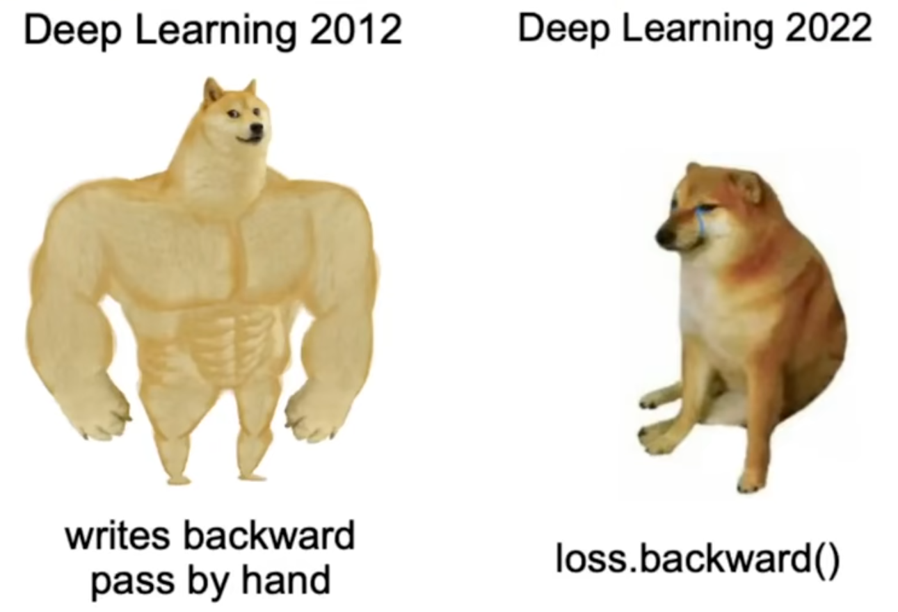

- [P5: 构建 makemore 第四部分：成为反向传播高手](#p5-构建-makemore-第四部分成为反向传播高手)
  - [链接](#链接)
  - [关键内容](#关键内容)

# P5: 构建 makemore 第四部分：成为反向传播高手
## 链接
B站视频链接：
+ [Andrej Karpathy【中英⚡从零构建 GPT（重制版）|Neural Networks: Zero to Hero】](https://www.bilibili.com/video/BV1mqrTBvEaf/?p=3&spm_id_from=333.1007.top_right_bar_window_history.content.click&vd_source=1019ffdc843339404e9df6ae52ff9e77)

Github项目：
+ <https://github.com/karpathy/makemore>
+ [Github: karpathy/nn-zero-to-hero](https://github.com/karpathy/nn-zero-to-hero)

## 关键内容
希望能够去掉对`pytorch`的自动实现: `loss.backward()`, 希望能从张量层面手动编写反向传播过程

[Andrej Karpathy-Yes you should understand backprop](https://karpathy.medium.com/yes-you-should-understand-backprop-e2f06eab496b)
+ 循环神经网络中的梯度爆炸和梯度消失，是接下来要研究的主要内容

