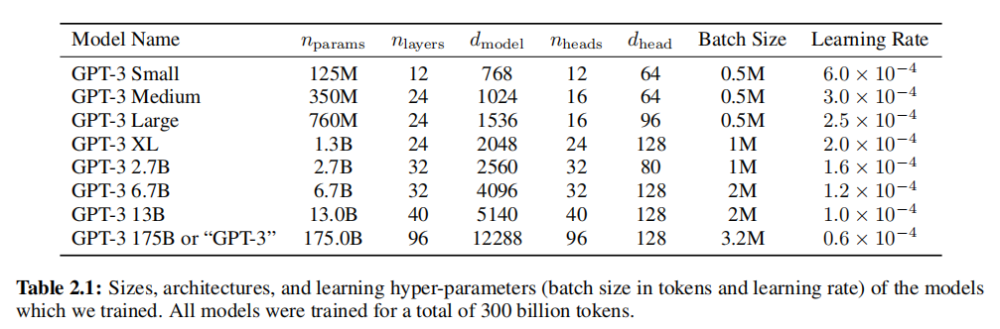

- [P7: 从零开始，用代码构建 GPT](#p7-从零开始用代码构建-gpt)
  - [链接](#链接)
  - [关键内容](#关键内容)
  - [训练的demo vs GPT3](#训练的demo-vs-gpt3)

# P7: 从零开始，用代码构建 GPT
## 链接
B站视频链接：
+ [Andrej Karpathy【中英⚡从零构建 GPT（重制版）|Neural Networks: Zero to Hero】](https://www.bilibili.com/video/BV1mqrTBvEaf/?p=3&spm_id_from=333.1007.top_right_bar_window_history.content.click&vd_source=1019ffdc843339404e9df6ae52ff9e77)

Github项目：
+ <https://github.com/karpathy/makemore>
+ [Github: karpathy/nn-zero-to-hero](https://github.com/karpathy/nn-zero-to-hero)

## 关键内容
+ 肯定不是复现chatGPT，而是实现一个基于Transformer的网络，同时也不是word-level的，而依然是character-level的
+ 这里老师选择的数据集是 [karpathy/tiny_shakespeare](https://huggingface.co/datasets/karpathy/tiny_shakespeare), 或者Github上的：<https://raw.githubusercontent.com/karpathy/char-rnn/master/data/tinyshakespeare/input.txt>
  + [karpathy/char-rnn/data/tinyshakespeare/input.txt](https://github.com/karpathy/char-rnn/blob/master/data/tinyshakespeare/input.txt), 在这个页面点击下载，而不是预览+自己复制到本地
  + 从这里可以看出，老师在11年前，也就是2015年就已经接触了RNN类的网络，同时在当年还用`lua`调用了`torch`来实现神经网络的训练
  + <https://github.com/karpathy/char-rnn/tree/master>
  + 所以老师之前的打算应该是想讲： [karpathy/char-rnn](https://github.com/karpathy/char-rnn/tree/master) 这个项目的
  + 这个项目的项目介绍： `Multi-layer Recurrent Neural Networks (LSTM, GRU, RNN) for character-level language models in Torch`
+ 可以尝试下金庸？？？
  + [分享 | 金庸全集武侠小说 全套共15 部 txt pdf epub mobi azw3](https://zhuanlan.zhihu.com/p/668049798)
  + [分享 | 金庸全集武侠小说作品集 全套共15 部 txt pdf epub mobi azw3](https://isanthree.github.io/2020/08/06/jin-yong-qian-ji-txt-pdf-epub-mobi-azw3-m/)

完整的训练过程位于： [karpathy/nanoGPT](https://github.com/karpathy/nanogpt)

Bigram示例代码位于： [karpathy/ng-video-lecture](https://github.com/karpathy/ng-video-lecture)
+ https://github.com/karpathy/ng-video-lecture/blob/master/bigram.py
+ 老师课上的v2版本对应于： https://github.com/karpathy/ng-video-lecture/blob/master/gpt.py

这节课用到的notebook地址(Google Colab): https://colab.research.google.com/drive/1JMLa53HDuA-i7ZBmqV7ZnA3c_fvtXnx-?usp=sharing

## 训练的demo vs GPT3
在[code\zero_gpt\bigram.py](../code/zero_gpt/bigram.py)中训练的模型
+ 模型参数量为: 10.79 M 也就是10 million， 即10百万，1000w参数量 
+ 总 token 数量: 338025，即训练语料是30w的tokens数量
+ 在一个`30w tokens`(用GPT3的分词器)的语料上训练了一个`1000w`参数的模型

对比GPT3，根据[Language Models are Few-Shot Learners.no_watermark.zh-CN.dual](../paper/Language%20Models%20are%20Few-Shot%20Learners.no_watermark.zh-CN.dual.pdf)

