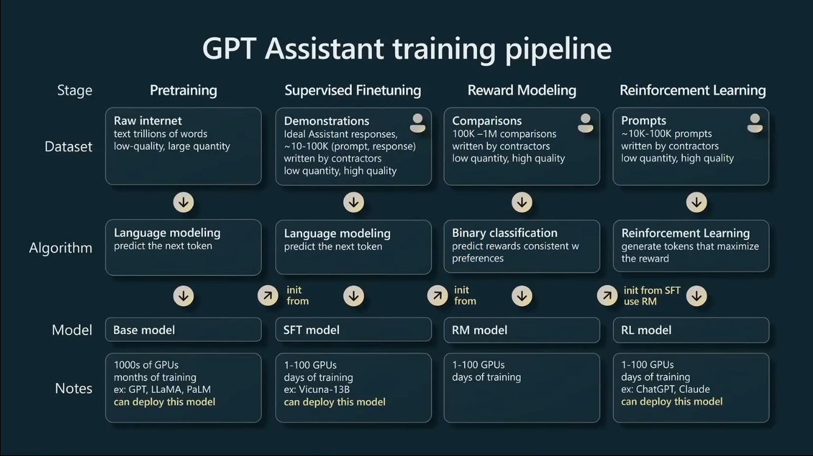
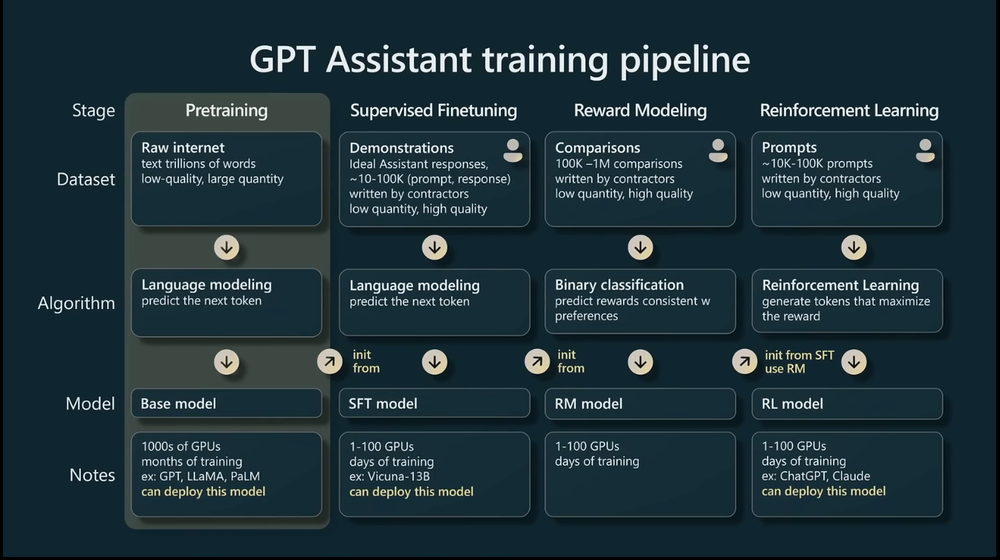
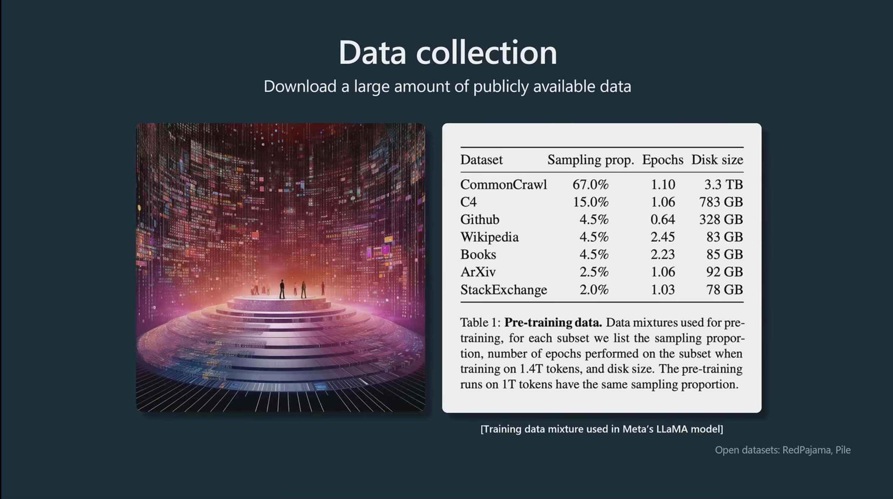
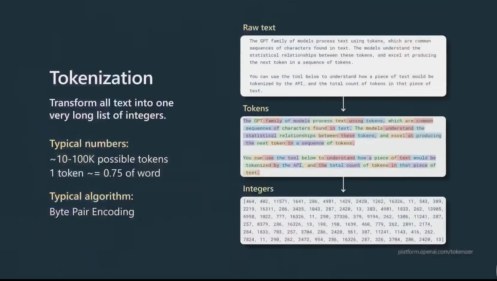
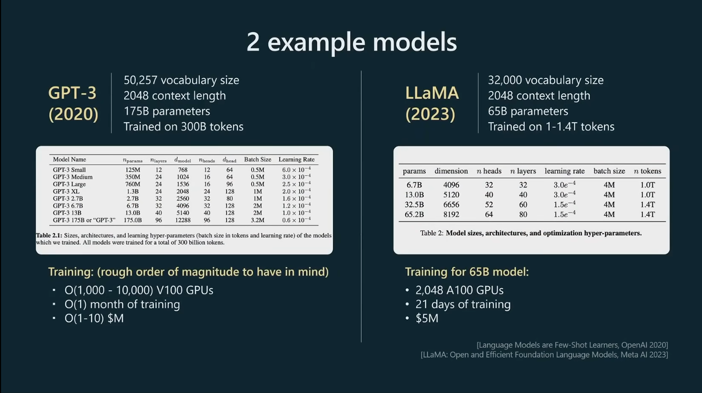
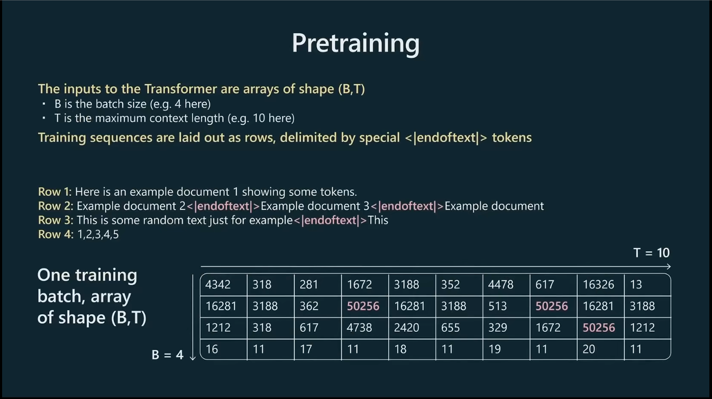
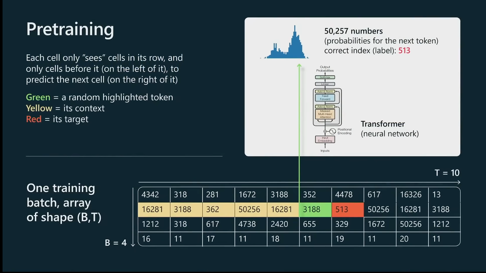
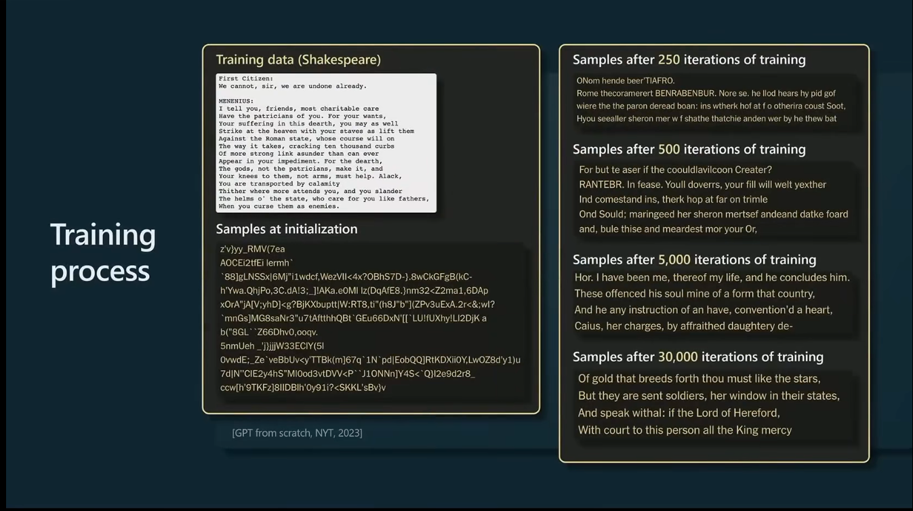

- [P3: 构建 makemore 第二部分：多层感知机](#p3-构建-makemore-第二部分多层感知机)
  - [链接](#链接)
  - [关键内容](#关键内容)

# P3: 构建 makemore 第二部分：多层感知机
## 链接
B站视频链接：
+ [Andrej Karpathy【中英⚡从零构建 GPT（重制版）|Neural Networks: Zero to Hero】](https://www.bilibili.com/video/BV1mqrTBvEaf/?p=3&spm_id_from=333.1007.top_right_bar_window_history.content.click&vd_source=1019ffdc843339404e9df6ae52ff9e77)

Github项目：
+ <https://github.com/karpathy/makemore>
+ [Github: karpathy/nn-zero-to-hero](https://github.com/karpathy/nn-zero-to-hero)

## 关键内容


GPT助手的训练分为四个阶段：
1. 预训练
2. 有监督微调
3. 奖励建模
4. 强化学习

**每个阶段都需要相应的数据来支持训练**



上图并没有反映每个阶段占有工作的实际比例，
+ 实际上，**预训练阶段承载了绝大部分的计算工作**，这个阶段消耗了99%的训练计算时间和浮点数运算(training compute time and flops).可能需要上千的GPU,训练数月之久
+ 其他三个阶段都属于微调阶段(包括SFT,Reward Modeling以及RL),数十个GPU,训练小时/天就可以




预训练阶段的数据收集:
+ 以llama的训练数据为例,[LLaMA: Open and Efficient Foundation Language Models](https://arxiv.org/pdf/2302.13971)
+ 数据量最大的两个,占比82%的是互联网爬取的数据;剩下18%是一些高质量数据,比如:代码库,维基百科,书籍,论文预印库,问答论坛等


+ **预训练阶段**，在将数据集混合,送入模型之前,需要进行的一个**预处理步骤**就是 分词,这个步骤的本质就是把文本序列转为整数序列, 整数序列才是GPT作用的原生数据表示(native representation)
+ 文本 → tokens → integers，三者之间的转换是无损的(lossless translation), 不会像以前的分词方法会损失空格，标点符号等
+ 可以去<https://platform.openai.com/tokenizer> 网站自己试下分词效果



+ 关于**预训练阶段的数据规模**，词汇表(vocabulary size)通常在几万个，比如：GPT3的词表是50257个，LLaMA的词表是32000个
+ `上下文长度`一般是1024的整数倍，比如2048，4096，现在一般都是百万上下文，1M(1024*1024=1048576), 例如： [deepseek-ai/DeepSeek-V4-Pro-"max_position_embeddings": 1048576,](https://www.modelscope.cn/models/deepseek-ai/DeepSeek-V4-Pro/file/view/master/config.json?status=1)，上下文长度这个参数决定了模型在预测下一个整数时，最多能参考多少个整数
+ 模型参数和模型能力的关系，如上表，
  + 虽然GPT-3有1750亿参数，而LLaMA只有650亿参数，前者约为后者的 2.7倍，但是LLaMA的实际效果看起来更强。
  + LLaMA接受了更长的训练时间，训练所使用的数据也更多，1T(1.4万亿) vs 300B(3000亿)， 数据量是GPT3的 4.7倍
  + 所以不能只凭模型的参数去评价模型的性能
+ 同时也可以看到两个模型用的GPU的情况
  + 根据[CS336——2. PyTorch, resource accounting-3.4.2 直观感受](https://blog.csdn.net/Castlehe/article/details/155040073): 想要去搜某个特定型号显卡的DataSheet，直接搜索nvidia-tensor-core-gpu-datasheet h100这样的关键字就好了
  + 这里对比下 A100和V100的差距
    + nvidia-a100-datasheet: <https://www.nvidia.com/content/dam/en-zz/Solutions/Data-Center/a100/pdf/nvidia-a100-datasheet-us-nvidia-1758950-r4-web.pdf.>
    + v100-datasheet: <https://images.nvidia.com/content/technologies/volta/pdf/volta-v100-datasheet-update-us-1165301-r5.pdf>

>[!NOTE]
>总体来说，训练很贵
>+ LLaMA `650亿`参数的模型，在`2048`个`A100` GPU上，用了`1.4万亿`的tokens数据，`3.2w`的词表，`2048`的上下文，训练了`21天`，花了大约`500万美元`
>+ GPT3是类似的
>+ 这就是关于预训练阶段，需要了解的一些量级(**准备工作**)



+ 实际预训练的时候，会将转换后的tokens IDs(整数序列)按批次组织成训练数据
+ 上图是一个batch_size=4, timestamp=10的示例（这里的 **`T`就是最大上下文长度**），注意，输入还不涉及嵌入，嵌入这个维度是在Transformer里有的
+ 实际处理的时候，会把内容按照行打包，并用特殊的文本分隔符作为分隔标记，比如：<endoftext>, 可以看到，表格里的 `50256` 其实就是那个分隔符(对应GPT 词表大小 50257，所以分隔符是GPT3的最后一个词)。
+ [openai-community/gpt2-config.json](https://huggingface.co/openai-community/gpt2/blob/main/config.json)中，有：
  ```json
    {
      "bos_token_id": 50256,
      "embd_pdrop": 0.1,
      "eos_token_id": 50256,
      ...
       "vocab_size": 50257
    }
  ```


+ 以其中绿色的单元格为例，预训练过程中，来说明某个批次中某个时间步所进行的操作
+ 当处理到绿色的单元格，即 3188 这个整数的时候，模型会分析这个绿色单元格之前的所有tokens/IDs, 即表格中的黄色单元格，绿色+黄色单元格一起作为上下文输入到Transformer网络中，Transformer会预测这个序列的下一个token，即这里的红色单元格
+ 上图的概率分布(蓝色的图像)，就是50257个可能的输出的概率分布（词表多大，就输出多少个概率），其中正确的概率标签是513，由于已知下一个正确的tokens IDs, 因此可以用这个作为监督信号，来更新网络的权重
+ 会对批次里的每个单元格都并行的应用以上计算方式


+ 这是来自纽约时报(NewYork Times)上的一个案例, 所以老师给的莎士比亚的案例其实来自于这里？？？
+ [GPT from scratch NYT 2023](https://www.nytimes.com/interactive/2023/04/26/upshot/gpt-from-scratch.html), 这个文章还需要付费。。。
+ 可以看出：
  + 初始化的时候参数是随机给的，所以生成的东西也很随机
  + 随着训练的进行，生成的样本越来越连贯和一致(coherent and consistent )
  