- [P3: 构建 makemore 第二部分：多层感知机](#p3-构建-makemore-第二部分多层感知机)
  - [链接](#链接)
  - [关键内容](#关键内容)

# P8: GPT现状BRK216HFS
## 链接
B站视频链接：
+ [Andrej Karpathy【中英⚡从零构建 GPT（重制版）|Neural Networks: Zero to Hero】](https://www.bilibili.com/video/BV1mqrTBvEaf/?p=3&spm_id_from=333.1007.top_right_bar_window_history.content.click&vd_source=1019ffdc843339404e9df6ae52ff9e77)

Github项目：
+ <https://github.com/karpathy/makemore>
+ [Github: karpathy/nn-zero-to-hero](https://github.com/karpathy/nn-zero-to-hero)

## 关键内容


GPT助手的训练分为四个阶段：
1. 预训练
2. 有监督微调
3. 奖励建模
4. 强化学习

**每个阶段都需要相应的数据来支持训练**


上图并没有反映每个阶段占有工作的实际比例，
+ 实际上，**预训练阶段承载了绝大部分的计算工作**，这个阶段消耗了99%的训练计算时间和浮点数运算(training compute time and flops).可能需要上千的GPU,训练数月之久
+ 其他三个阶段都属于微调阶段(包括SFT,Reward Modeling以及RL),数十个GPU,训练小时/天就可以


预训练阶段的数据收集:
+ 以llama的训练数据为例,[LLaMA: Open and Efficient Foundation Language Models](https://arxiv.org/pdf/2302.13971)
+ 数据量最大的两个,占比82%的是互联网爬取的数据;剩下18%是一些高质量数据,比如:代码库,维基百科,书籍,论文预印库,问答论坛等


+ **预训练阶段**，在将数据集混合,送入模型之前,需要进行的一个**预处理步骤**就是 分词,这个步骤的本质就是把文本序列转为整数序列, 整数序列才是GPT作用的原生数据表示(native representation)
+ 文本 → tokens → integers，三者之间的转换是无损的(lossless translation), 不会像以前的分词方法会损失空格，标点符号等
+ 可以去<https://platform.openai.com/tokenizer> 网站自己试下分词效果


+ 关于**预训练阶段的数据规模**，词汇表(vocabulary size)通常在几万个，比如：GPT3的词表是50257个，LLaMA的词表是32000个
+ `上下文长度`一般是1024的整数倍，比如2048，4096，现在一般都是百万上下文，1M(1024*1024=1048576), 例如： [deepseek-ai/DeepSeek-V4-Pro-"max_position_embeddings": 1048576,](https://www.modelscope.cn/models/deepseek-ai/DeepSeek-V4-Pro/file/view/master/config.json?status=1)，上下文长度这个参数决定了模型在预测下一个整数时，最多能参考多少个整数
+ 模型参数和模型能力的关系，如上表，
  + 虽然GPT-3有1750亿参数，而LLaMA只有650亿参数，前者约为后者的 2.7倍，但是LLaMA的实际效果看起来更强。
  + LLaMA接受了更长的训练时间，训练所使用的数据也更多，1T(1.4万亿) vs 300B(3000亿)， 数据量是GPT3的 4.7倍
  + 所以不能只凭模型的参数去评价模型的性能
+ 同时也可以看到两个模型用的GPU的情况
  + 根据[CS336——2. PyTorch, resource accounting-3.4.2 直观感受](https://blog.csdn.net/Castlehe/article/details/155040073): 想要去搜某个特定型号显卡的DataSheet，直接搜索nvidia-tensor-core-gpu-datasheet h100这样的关键字就好了
  + 这里对比下 A100和V100的差距
    + nvidia-a100-datasheet: <https://www.nvidia.com/content/dam/en-zz/Solutions/Data-Center/a100/pdf/nvidia-a100-datasheet-us-nvidia-1758950-r4-web.pdf.>
    + v100-datasheet: <https://images.nvidia.com/content/technologies/volta/pdf/volta-v100-datasheet-update-us-1165301-r5.pdf>

>[!NOTE]
>总体来说，训练很贵
>+ LLaMA `650亿`参数的模型，在`2048`个`A100` GPU上，用了`1.4万亿`的tokens数据，`3.2w`的词表，`2048`的上下文，训练了`21天`，花了大约`500万美元`
>+ GPT3是类似的
>+ 这就是关于预训练阶段，需要了解的一些量级(**准备工作**)


+ 实际预训练的时候，会将转换后的tokens IDs(整数序列)按批次组织成训练数据
+ 上图是一个batch_size=4, timestamp=10的示例（这里的 **`T`就是最大上下文长度**），注意，输入还不涉及嵌入，嵌入这个维度是在Transformer里有的
+ 实际处理的时候，会把内容按照行打包，并用特殊的文本分隔符作为分隔标记，比如：<endoftext>, 可以看到，表格里的 `50256` 其实就是那个分隔符(对应GPT 词表大小 50257，所以分隔符是GPT3的最后一个词)。
+ [openai-community/gpt2-config.json](https://huggingface.co/openai-community/gpt2/blob/main/config.json)中，有：
  ```json
    {
      "bos_token_id": 50256,
      "embd_pdrop": 0.1,
      "eos_token_id": 50256,
      ...
       "vocab_size": 50257
    }
  ```


+ 以其中绿色的单元格为例，预训练过程中，来说明某个批次中某个时间步所进行的操作
+ 当处理到绿色的单元格，即 3188 这个整数的时候，模型会分析这个绿色单元格之前的所有tokens/IDs, 即表格中的黄色单元格，绿色+黄色单元格一起作为上下文输入到Transformer网络中，Transformer会预测这个序列的下一个token，即这里的红色单元格
+ 上图的概率分布(蓝色的图像)，就是50257个可能的输出的概率分布（词表多大，就输出多少个概率），其中正确的概率标签是513，由于已知下一个正确的tokens IDs, 因此可以用这个作为监督信号，来更新网络的权重
+ 会对批次里的每个单元格都并行的应用以上计算方式


+ 这是来自纽约时报(NewYork Times)上的一个案例, 所以老师给的莎士比亚的案例其实来自于这里？？？
+ [GPT from scratch NYT 2023](https://www.nytimes.com/interactive/2023/04/26/upshot/gpt-from-scratch.html), 这个文章还需要付费。。。
+ 可以看出：
  + 初始化的时候参数是随机给的，所以生成的东西也很随机
  + 随着训练的进行，生成的样本越来越连贯和一致(coherent and consistent )
  + 最终会发现，模型掌握了单词，空格和标点符号的位置


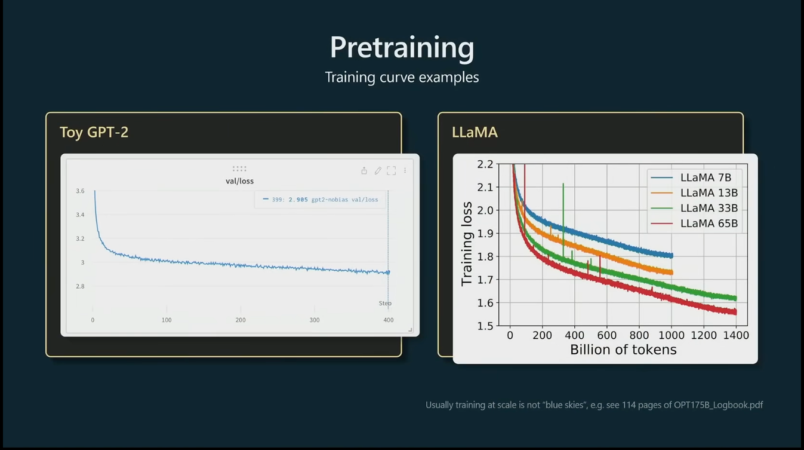
+ 上图右侧LLaMA内容来自： [projects/OPT/chronicles/OPT175B_Logbook.pdf](https://github.com/facebookresearch/metaseq/blob/main/projects/OPT/chronicles/OPT175B_Logbook.pdf)
  + 其实看[projects/OPT/chronicles/README.md](http://github.com/facebookresearch/metaseq/blob/main/projects/OPT/chronicles/README.md)就好了，这个其实是训练过程的损失曲线记录

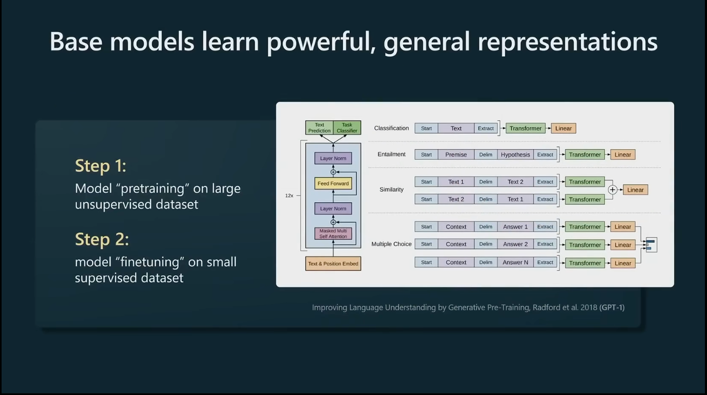
+ 语言模型在预训练之后，获得了强大的通用表示能力(general representations); 这意味着我们可以通过微调，将模型快速适配到任何感兴趣的下游任务中。
+ 预训练之后的基座模型，之所以可以只使用很少的数据就适配下游任务，是因为：
  + 想要准确预测下一个token，必须深入理解文本结构以及其中蕴含的各种概念
  + 所以**Transformer的训练过程本质上是在处理大量的语言建模任务，看起来是一个损失函数，但是本质是multitask**

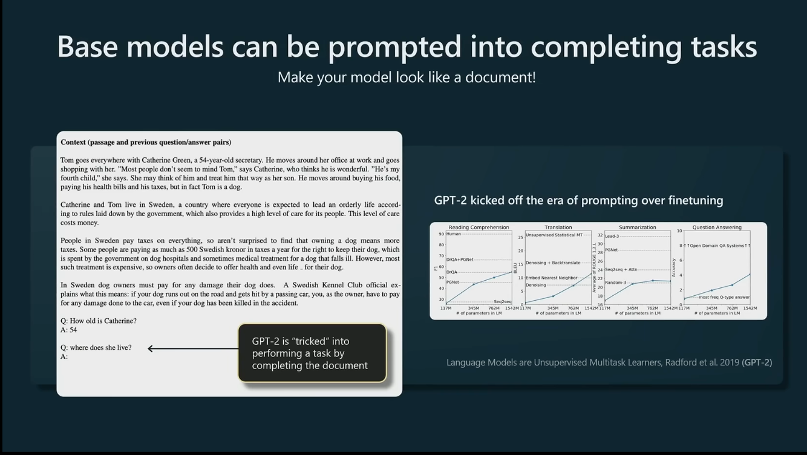
+ GPT-1的时候，发现`微调`是一种高效适配下游任务的方案
+ 到了GPT-2的时候，发现`通过提示工程`就可以高效激发模型潜力
  + 语言模型本质上是在学习如何补全文档(complete documents)
  + 因此可以通过设计文档(即：特征工程)来引导模型执行特定任务
  + 比如，上图中的例子，给了一段背景材料，先自问自答给了一个QA，然后再提出真正的问题，让模型去生成答案。 
  + 这里的第一个QA就是 **Few-shot prompt, 小样本提示**
  + 而对于第二个Q，网络则会基于`文档补全`的逻辑，自动生成对应的答案
  + **这里开启了提示词时代，开始可以和AI对话了，chatbot的雏形**
  + 这里还都只是预训练模型的作用： **预训练模型 通过 提示词引导(比如： Few-shot prompt)，也是可以进行问答的**
  + 即便不通过微调训练，通过精心设计的提示词工程， 就可以让模型在大量下游任务上取得很好的效果
+ 上图来自 GPT-2 论文的最后一页(附录的最后一个例子)

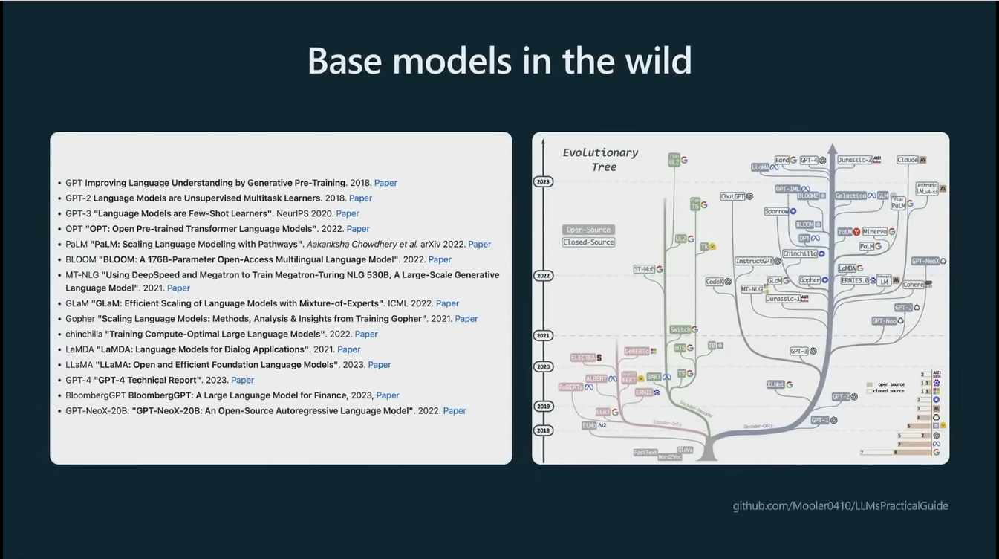
+ 从GPT-2之后，就百花齐放百家争鸣了，出现了大量的模型， [Mooler0410/LLMsPracticalGuide](https://github.com/Mooler0410/LLMsPracticalGuide), 来自论文[Harnessing the Power of LLMs in Practice: A Survey onChatGPT and Beyond](https://dl.acm.org/doi/epdf/10.1145/3649506)
+ 还有这个项目：[rasbt/LLMs-from-scratch](https://github.com/rasbt/LLMs-from-scratch)
+ 但是很多模型是不开源的， GPT-4和GPT-3都是通过API访问的
  + GPT-3 base model的API是通过名称`Devanshi`访问的，
  + 而GPT-4的API访问的不是base model，而是经过调优的助手模型
  + GPT-2是开源的

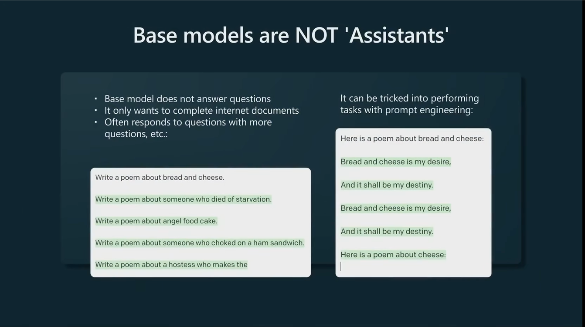
+ base model并不是助手模型，在正常状态下并不会直接回答问题
+ 比如：你输入一个问题，它会按照补全文档的逻辑给出更多的问题
+ 如果想让它回答问题，则需要用特征工程这个技巧来编造一些通过补全文档可以实现的任务，比如：介绍下面是一段关于面包奶酪的诗，来让它补全

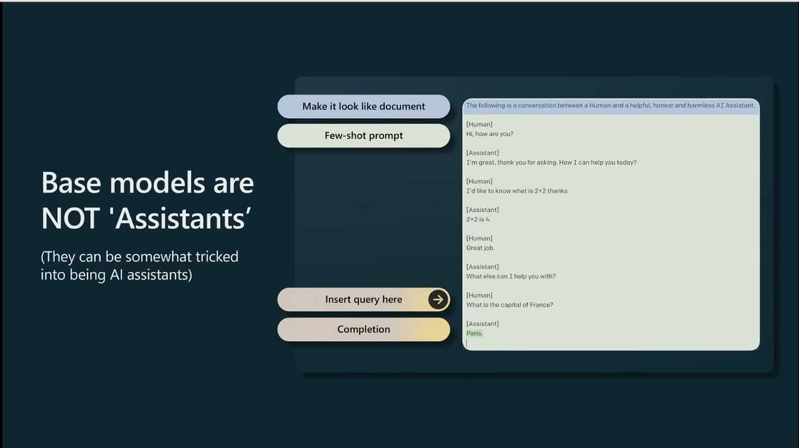
+ 甚至可以通过巧妙设计，让base model扮演助手的角色，主要还是要设计`Few-shot prompt`, 如上图，内容是：模拟助手和人类对话的场景。让模型理解这种对话模式，之后提出问题，让模型补全回答
+ 虽然技术上可行，但是这种方式效果有限，同时也不稳定
+ 因此采取另一种路径来打造真正的GPT助手，而不是文档补全模型(model document completers)， 这就引出了监督微调方法


---

这里补充一下**大模型的监督微调**，和以前**基于Bert这种通用语言模型进行下游任务例如情感分析的微调**的区别：

**prompt**: 大模型领域的基于基座模型的监督微调，和以前基于Bert这种通用语言模型进行下游任务例如情感分析的微调，这两种微调有什么区别？

|类目|传统微调/BERT 微调|监督微调/大模型 SFT|
|---|---|---|
|**是否注入新知识**| 学习新任务<br/>BERT 在预训练阶段只学习了通用的语言表示（如完形填空、下一句预测），它本身并不懂什么是“情感分析”或“命名实体识别”。<br/>微调的本质是让模型学习一个全新的下游任务，将预训练学到的通用特征映射到特定任务的标签空间。|激发潜能与对齐<br/>大模型在预训练阶段已经“阅读”了海量互联网数据，它本身已经具备了情感分析、逻辑推理等几乎所有知识（Zero-shot 能力）。<br/>SFT 的本质不是教它新知识，而是“激发”它已有的能力，并教它如何遵循人类的指令、以人类期望的格式和语气输出结果（即**意图对齐和格式对齐**）。|
|**微调过程中网络结构是否改变**|通常需要在预训练模型的基础上增加特定任务的网络层。<br/>例如，做情感分析时，会在 BERT 顶部加一个全连接层（Classification Head），将 [CLS] token 的向量映射到具体的类别数（如 2 分类）|通常不改变模型的原有结构，不增加任何额外的分类头或任务特定层。<br/>它直接复用预训练模型的架构（通常直接复用预训练的 LM Head），仅仅是更新模型内部的权重（或使用 LoRA 等参数高效微调方法）。|
|**损失函数**|损失函数是任务特定的。<br/>例如分类任务使用交叉熵损失（Cross-Entropy），只计算 [CLS] token 输出 logits 与真实标签之间的 Loss。|损失函数与预训练时完全一致，依然是自回归语言模型损失（Causal LM Loss，即 Next-token prediction）。<br/>关键区别在于 Loss 的计算范围：在 SFT 中，输入（Prompt/Instruction）和输出（Response）会拼接在一起，但只计算 Response（回复）部分的 Loss，Prompt 部分的 Loss 会被 mask 掉（不参与梯度更新）。|
|**数据格式**|数据格式通常是 “文本-标签”对。<br/>例如：“这部电影真好看” -> 1 (正面)。<br/>数据量通常较小（几千到几万条），高度依赖昂贵的人工标注，且数据格式高度定制化。|数据格式是 “指令-回复”对（Prompt-Response） 或多轮对话。<br/>例如：“请分析以下电影评论的情感：‘这部电影真好看’” -> “这条评论表达了正面的情感...”。<br/>数据量较大（几万到几十万条），除了人工标注，现在大量依赖大模型自身合成数据（如 Self-Instruct, Evol-Instruct）以及高质量的数据筛选。|
|**任务范式**|属于**判别式（Discriminative）** 模型。<br/>输入是固定的文本，输出是离散的类别、实体边界或相似度分数。它擅长“理解”和“分类”。|属于**生成式（Generative）** 模型。<br/>输入是开放的自然语言指令，输出也是开放的自然语言文本。它擅长“生成”、“对话”和“推理”。|
|**参数规模与微调策略**|模型参数量小（通常在 1亿 - 3亿级别），算力消耗低，通常采用全参数微调（Full Fine-tuning）。|模型参数量巨大（70亿 - 数千亿级别），全参数微调成本极高。因此，大模型时代衍生出了繁荣的参数高效微调（PEFT） 技术，如 LoRA、QLoRA、P-Tuning 等，通过冻结大部分预训练权重，只训练极少量的新增参数（通常不到原模型的 1%）来达到接近全参数微调的效果。|

>[!NOTE]
> 反正监督微调这个词，就是专门用于对基座模型训练，获取chatBot的，专门是这类模型对这类任务的~

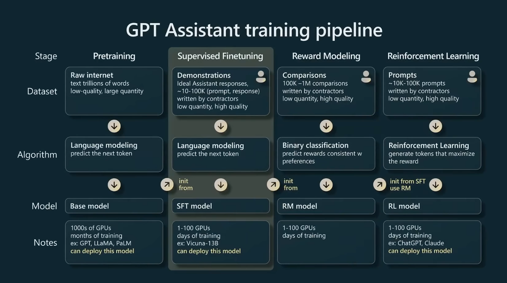

SFT模型来自Base model，但是算法一样（网络结构并没有修改）

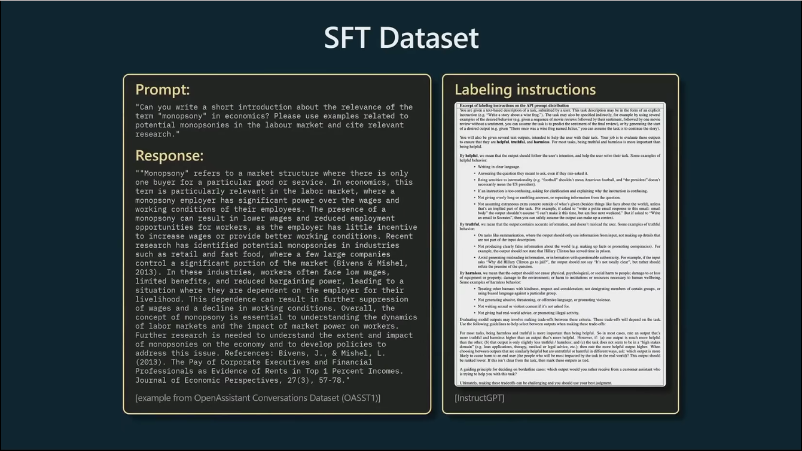
+ 图中数据来自：[OpenAssistant/oasst1](https://huggingface.co/datasets/OpenAssistant/oasst1/viewer/default/train?row=0)
+ 右侧的标注规范(给标注人员看的手册)来自：[Training language models to follow instructions with human feedback](https://arxiv.org/pdf/2203.02155)-> `B.2 Labeling instructions`, p37和p38的Figure10和11，正文里写的是Table10和11，但是表格下面标注的是Figure
  + 对应的OpenAI的blog: [根据指令调整语言模型](https://openai.com/zh-Hans-CN/index/instruction-following/)

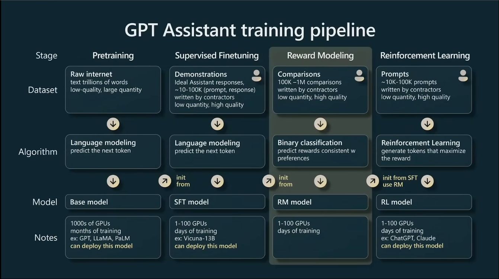
+ SFT（监督微调）之后，下一步就是奖励建模和强化学习，或者统一为：`Reinforcement learning from human feedback`(基于人类反馈的强化学习阶段)
+ 即**RLHF包含奖励建模和强化学习两个阶段**

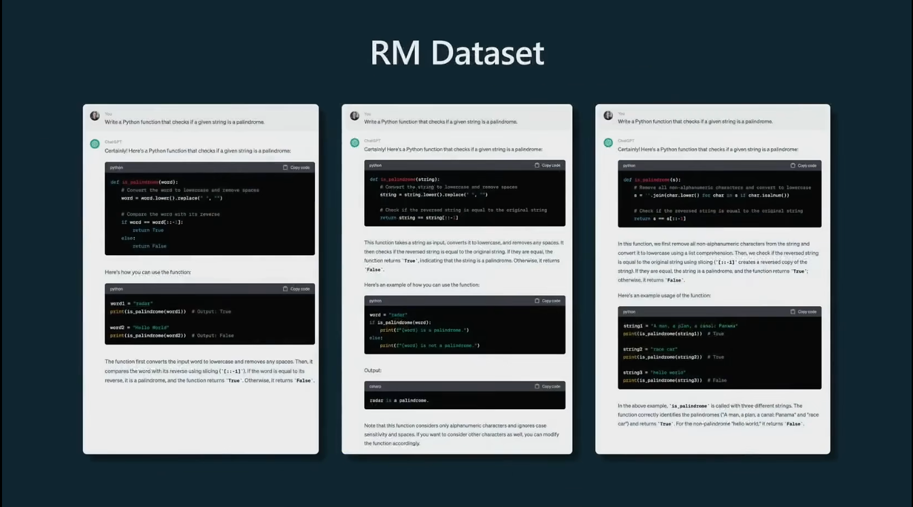

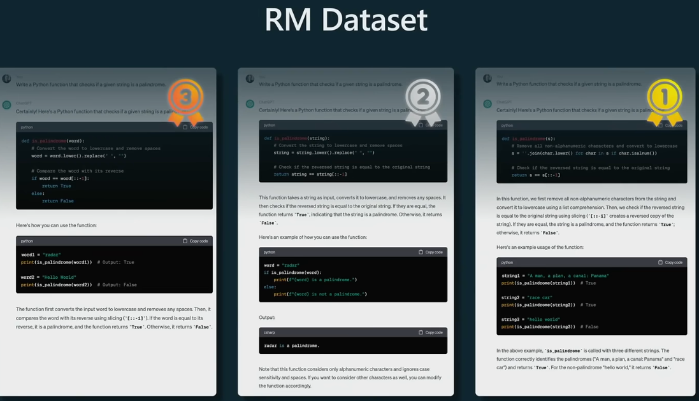
+ 在奖励建模阶段，会调整数据收集的方式，转为采用对比形式的数据
+ 最上方是同一个提示词/prompt, 然后用已经训练好的SFT模型，生成多个不同的回答，然后人工对这些回答进行排序

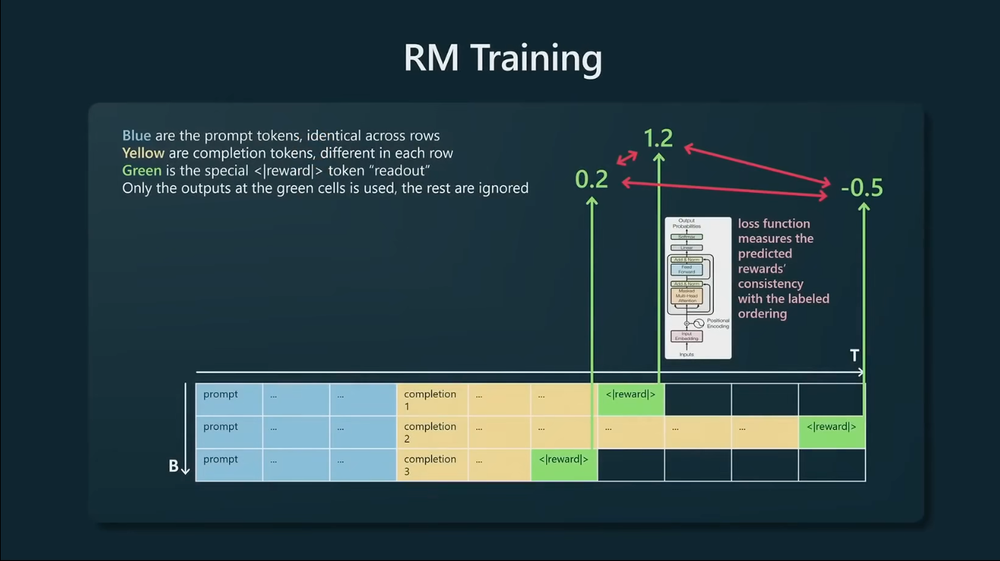
+ 排序后，对所有这些回答进行类似二元分类的操作
+ 如上表，三行的一个表格，第一部分都是prompt(蓝色的，prompt是一样的)，然后后面跟着SFT模型生成的不同的回答（黄色部分），然后在生成的回答末尾添加一个特殊的tokens标记
+ 这里说的只在这个绿色token处进行监督训练的意思就是，**不会对所有timestamp做监督训练，每个batch只在绿色token的这一个timestamp处进行监督训练**
+ 然后Transformer会预测这个completion在这个prompt下回答的多好，给出一个奖励值/评分，然后把预测的这个评分和真实标注的实际排序对比（一般是要求某个completion的评分比其他的高，即： 1st排名的分数要是最高的），以此作为损失函数设置的依据。


----

关于那个标记，没找到，只在[openai/webgpt_comparisons](https://huggingface.co/datasets/openai/webgpt_comparisons/viewer/default/train?row=0)里看到每个回答(prefix和completion的最后一个IDs都是 48366)
```python
# https://github.com/openai/openai-cookbook/blob/main/examples/How_to_count_tokens_with_tiktoken.ipynb
# 一共就四种encoding方案
import tiktoken
encoding = tiktoken.get_encoding("cl100k_base") #r50k_base #o200k_base #cl100k_base # p50k_base
token_ids = [48366]
decoded_text = encoding.decode(token_ids)
print(f"序列解码结果: {decoded_text}")
# 序列解码结果: ?).
```
+ 类似的查看模型特殊标记的：
  + [openai-mirror/gpt-oss-20b/special_tokens_map.json](https://www.modelscope.cn/models/openai-mirror/gpt-oss-20b/file/view/master/special_tokens_map.json?status=1)
  + [openai-mirror/gpt-oss-20b/tokenizer_config.json](https://www.modelscope.cn/models/openai-mirror/gpt-oss-20b/file/view/master/tokenizer_config.json?status=1)
  + [Qwen/Qwen3-4B-AWQ/tokenizer_config.json](https://www.modelscope.cn/models/Qwen/Qwen3-4B-AWQ/file/view/master/tokenizer_config.json?status=1)
  + [Qwen/Qwen3-4B-AWQ/generation_config.json](https://www.modelscope.cn/models/Qwen/Qwen3-4B-AWQ/file/view/master/generation_config.json?status=1)

另外，关于奖励模型的一些论文/博客：
+ [Interpreting Black Box Reward Models](https://alignment.openai.com/argo/)
+ InstructGPT: [Training language models to follow instructions with human feedback](https://arxiv.org/pdf/2203.02155)
+ [Fine-Tuning Language Models from Human Preferences](https://arxiv.org/pdf/1909.08593)

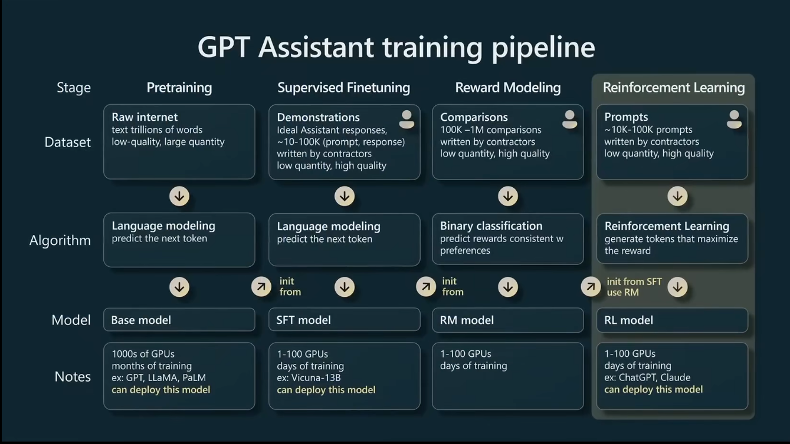
+ 有了奖励模型后，也不能直接部署，因为奖励模型并不足以成为一个实用的助手；但是奖励模型对强化学习是至关重要的
+ 