- [P8: GPT现状BRK216HFS](#p8-gpt现状brk216hfs)
  - [链接](#链接)
- [关键内容](#关键内容)
  - [1. GPT助手全流程](#1-gpt助手全流程)
    - [预训练阶段——数据收集](#预训练阶段数据收集)
    - [预训练阶段——构建的数据集](#预训练阶段构建的数据集)
    - [预训练阶段——训练](#预训练阶段训练)
    - [预训练阶段——微调/提示词工程](#预训练阶段微调提示词工程)
    - [大模型的监督微调 VS 基于Bert这种通用语言模型进行下游任务例如情感分析的微调](#大模型的监督微调-vs-基于bert这种通用语言模型进行下游任务例如情感分析的微调)
    - [SFT](#sft)
    - [SFT-数据集构建和标注](#sft-数据集构建和标注)
    - [RLHF](#rlhf)
    - [RLHF-数据](#rlhf-数据)
    - [RLHF-训练](#rlhf-训练)
    - [RLHF-奖励模型](#rlhf-奖励模型)
    - [奖励模型（Reward Model, RM）训练的损失函数 VS 强化学习（RL）策略模型训练的损失函数](#奖励模型reward-model-rm训练的损失函数-vs-强化学习rl策略模型训练的损失函数)
    - [why RLHF](#why-rlhf)
    - [ChatBot Areana](#chatbot-areana)
  - [2. 高效使用GPT来解决实际问题](#2-高效使用gpt来解决实际问题)
    - [举例说明](#举例说明)
    - [CoT](#cot)
    - [self-consistency 自我一致性](#self-consistency-自我一致性)
    - [self-reflection 自我反思](#self-reflection-自我反思)
    - [提示工程总结](#提示工程总结)
    - [Tree of Thoughts](#tree-of-thoughts)
    - [ReAct](#react)
    - [LLM固有的局限(改善模仿→更准确)](#llm固有的局限改善模仿更准确)
    - [Tool use](#tool-use)


# P8: GPT现状BRK216HFS
## 链接
B站视频链接：
+ [Andrej Karpathy【中英⚡从零构建 GPT（重制版）|Neural Networks: Zero to Hero】](https://www.bilibili.com/video/BV1mqrTBvEaf/?p=3&spm_id_from=333.1007.top_right_bar_window_history.content.click&vd_source=1019ffdc843339404e9df6ae52ff9e77)

Github项目：
+ <https://github.com/karpathy/makemore>
+ [Github: karpathy/nn-zero-to-hero](https://github.com/karpathy/nn-zero-to-hero)


# 关键内容
## 1. GPT助手全流程
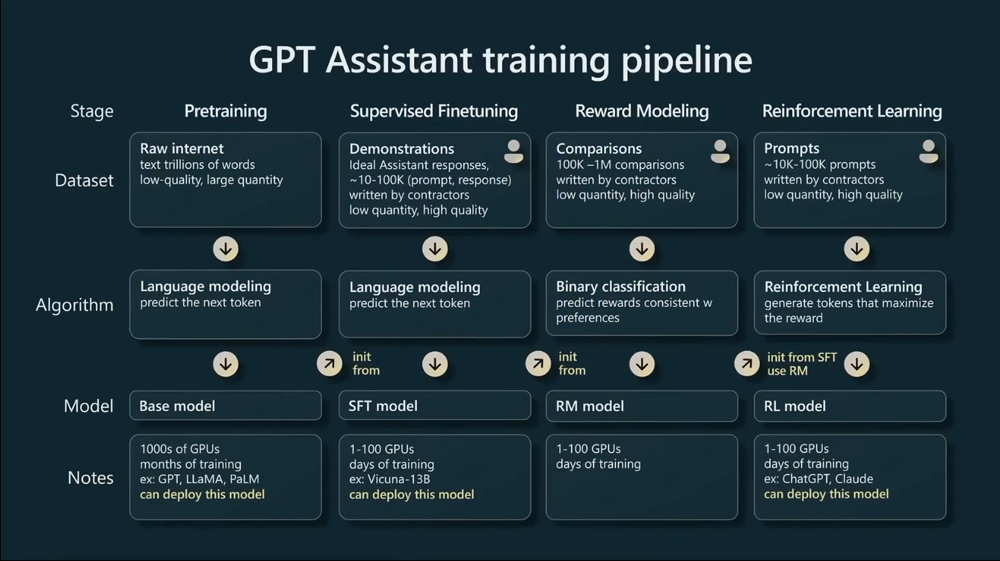

GPT助手的训练分为四个阶段：
1. 预训练
2. 有监督微调
3. 奖励建模
4. 强化学习

**每个阶段都需要相应的数据来支持训练**

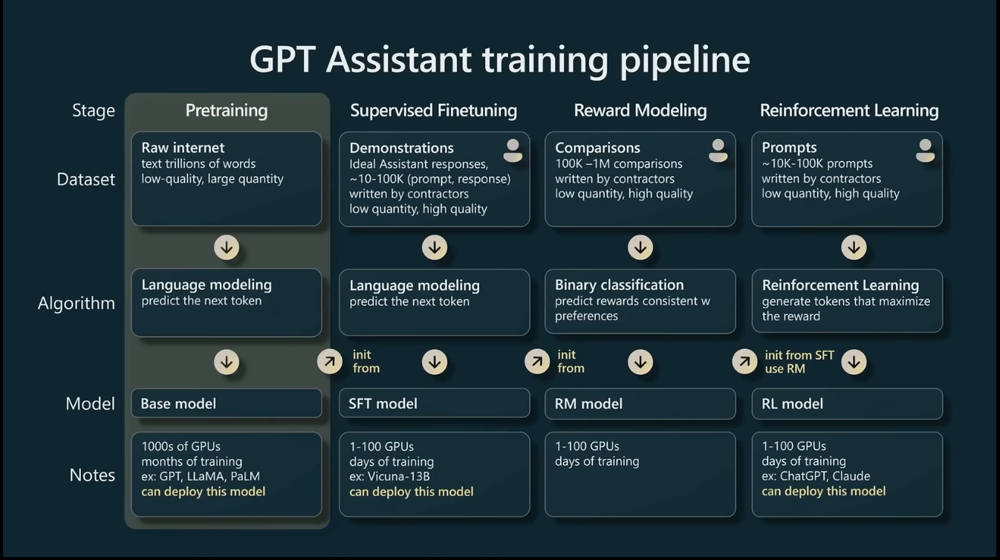

上图并没有反映每个阶段占有工作的实际比例，
+ 实际上，**预训练阶段承载了绝大部分的计算工作**，这个阶段消耗了99%的训练计算时间和浮点数运算(training compute time and flops).可能需要上千的GPU,训练数月之久
+ 其他三个阶段都属于微调阶段(包括SFT,Reward Modeling以及RL),数十个GPU,训练小时/天就可以


### 预训练阶段——数据收集

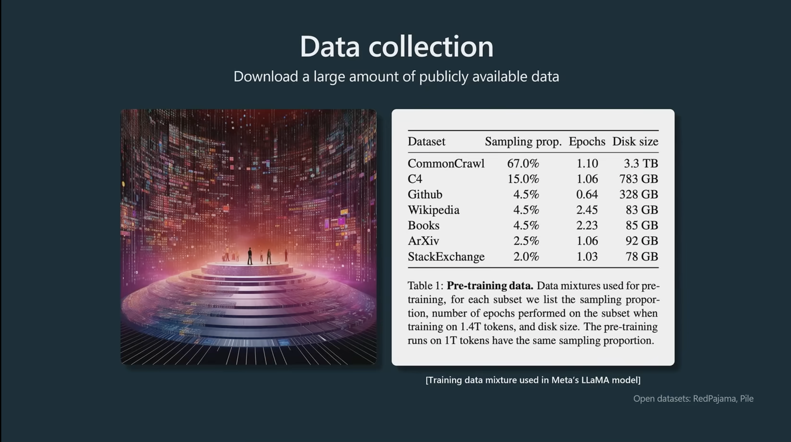

预训练阶段的数据收集:
+ 以llama的训练数据为例,[LLaMA: Open and Efficient Foundation Language Models](https://arxiv.org/pdf/2302.13971)
+ 数据量最大的两个,占比82%的是互联网爬取的数据;剩下18%是一些高质量数据,比如:代码库,维基百科,书籍,论文预印库,问答论坛等

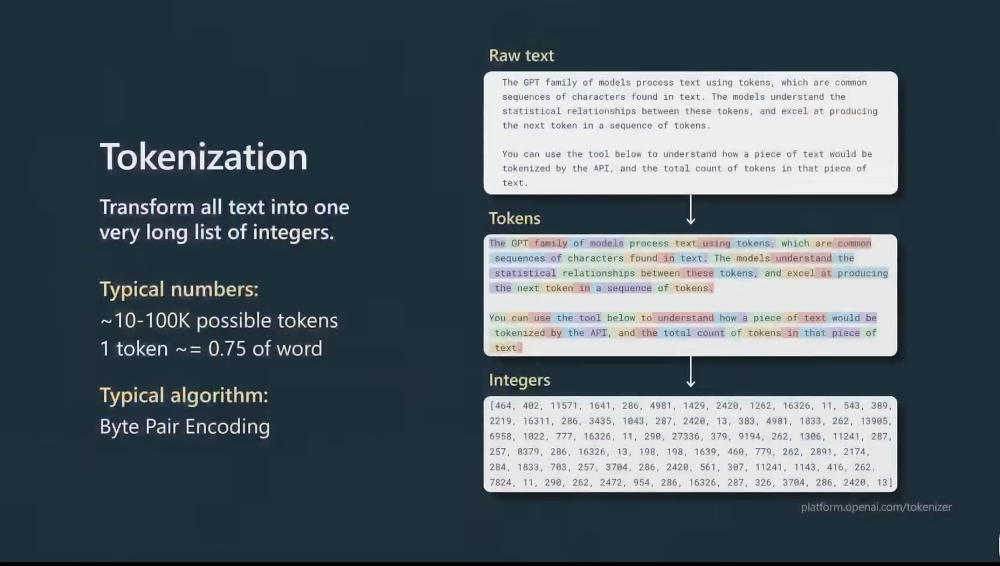
+ **预训练阶段**，在将数据集混合,送入模型之前,需要进行的一个**预处理步骤**就是 分词,这个步骤的本质就是把文本序列转为整数序列, 整数序列才是GPT作用的原生数据表示(native representation)
+ 文本 → tokens → integers，三者之间的转换是无损的(lossless translation), 不会像以前的分词方法会损失空格，标点符号等
+ 可以去<https://platform.openai.com/tokenizer> 网站自己试下分词效果


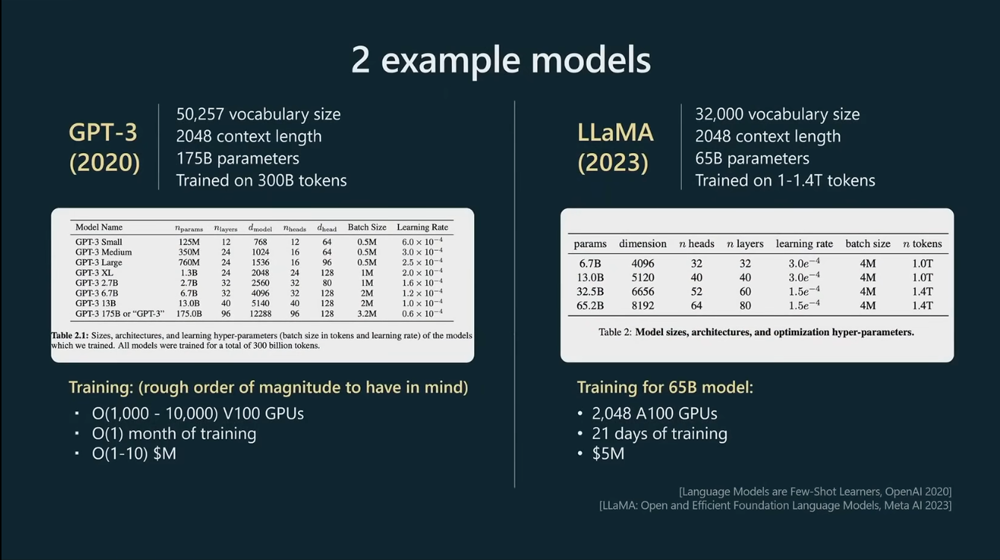
+ 关于**预训练阶段的数据规模**，词汇表(vocabulary size)通常在几万个，比如：GPT3的词表是50257个，LLaMA的词表是32000个
+ `上下文长度`一般是1024的整数倍，比如2048，4096，现在一般都是百万上下文，1M(1024*1024=1048576), 例如： [deepseek-ai/DeepSeek-V4-Pro-"max_position_embeddings": 1048576,](https://www.modelscope.cn/models/deepseek-ai/DeepSeek-V4-Pro/file/view/master/config.json?status=1)，上下文长度这个参数决定了模型在预测下一个整数时，最多能参考多少个整数
+ 模型参数和模型能力的关系，如上表，
  + 虽然GPT-3有1750亿参数，而LLaMA只有650亿参数，前者约为后者的 2.7倍，但是LLaMA的实际效果看起来更强。
  + LLaMA接受了更长的训练时间，训练所使用的数据也更多，1T(1.4万亿) vs 300B(3000亿)， 数据量是GPT3的 4.7倍
  + 所以不能只凭模型的参数去评价模型的性能
+ 同时也可以看到两个模型用的GPU的情况
  + 根据[CS336——2. PyTorch, resource accounting-3.4.2 直观感受](https://blog.csdn.net/Castlehe/article/details/155040073): 想要去搜某个特定型号显卡的DataSheet，直接搜索nvidia-tensor-core-gpu-datasheet h100这样的关键字就好了
  + 这里对比下 A100和V100的差距
    + nvidia-a100-datasheet: <https://www.nvidia.com/content/dam/en-zz/Solutions/Data-Center/a100/pdf/nvidia-a100-datasheet-us-nvidia-1758950-r4-web.pdf.>
    + v100-datasheet: <https://images.nvidia.com/content/technologies/volta/pdf/volta-v100-datasheet-update-us-1165301-r5.pdf>

>[!NOTE]
>总体来说，训练很贵
>+ LLaMA `650亿`参数的模型，在`2048`个`A100` GPU上，用了`1.4万亿`的tokens数据，`3.2w`的词表，`2048`的上下文，训练了`21天`，花了大约`500万美元`
>+ GPT3是类似的
>+ 这就是关于预训练阶段，需要了解的一些量级(**准备工作**)

### 预训练阶段——构建的数据集

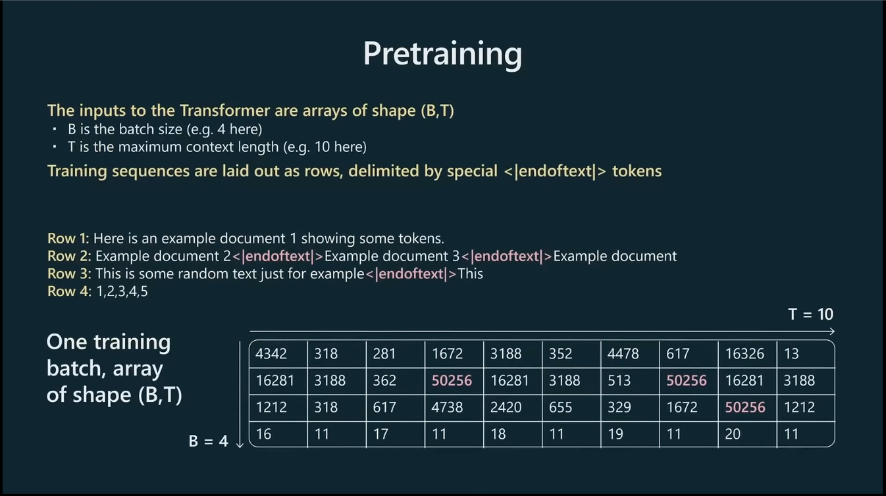
+ 实际预训练的时候，会将转换后的tokens IDs(整数序列)按批次组织成训练数据
+ 上图是一个batch_size=4, timestamp=10的示例（这里的 **`T`就是最大上下文长度**），注意，输入还不涉及嵌入，嵌入这个维度是在Transformer里有的
+ 实际处理的时候，会把内容按照行打包，并用特殊的文本分隔符作为分隔标记，比如：<endoftext>, 可以看到，表格里的 `50256` 其实就是那个分隔符(对应GPT 词表大小 50257，所以分隔符是GPT3的最后一个词)。
+ [openai-community/gpt2-config.json](https://huggingface.co/openai-community/gpt2/blob/main/config.json)中，有：
  ```json
    {
      "bos_token_id": 50256,
      "embd_pdrop": 0.1,
      "eos_token_id": 50256,
      ...
       "vocab_size": 50257
    }
  ```

### 预训练阶段——训练

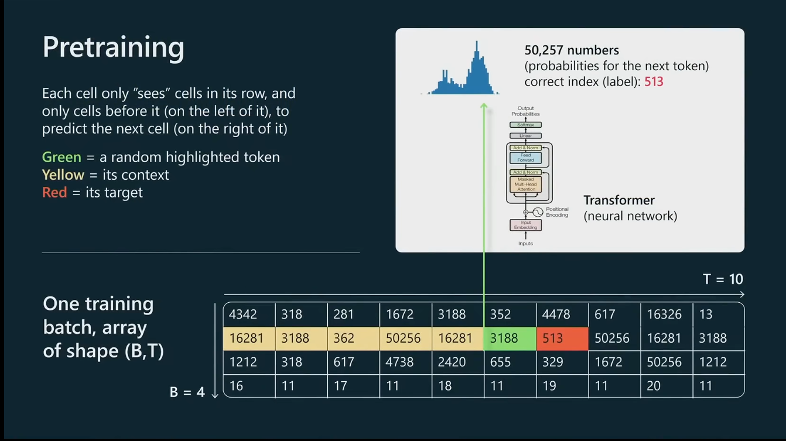
+ 以其中绿色的单元格为例，预训练过程中，来说明某个批次中某个时间步所进行的操作
+ 当处理到绿色的单元格，即 3188 这个整数的时候，模型会分析这个绿色单元格之前的所有tokens/IDs, 即表格中的黄色单元格，绿色+黄色单元格一起作为上下文输入到Transformer网络中，Transformer会预测这个序列的下一个token，即这里的红色单元格
+ 上图的概率分布(蓝色的图像)，就是50257个可能的输出的概率分布（词表多大，就输出多少个概率），其中正确的概率标签是513，由于已知下一个正确的tokens IDs, 因此可以用这个作为监督信号，来更新网络的权重
+ 会对批次里的每个单元格都并行的应用以上计算方式

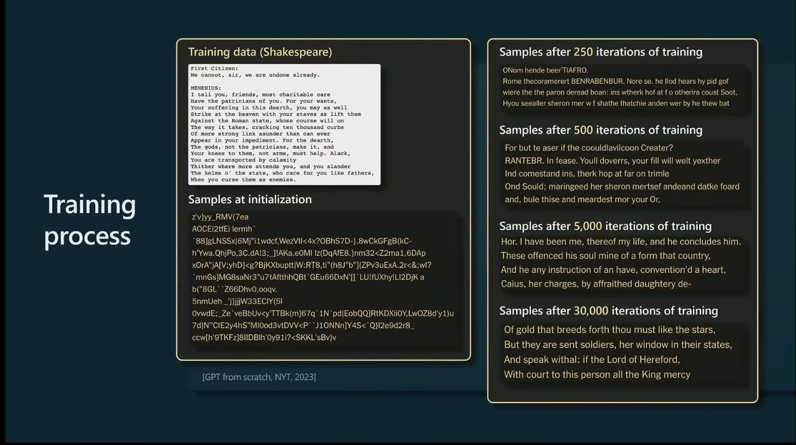
+ 这是来自纽约时报(NewYork Times)上的一个案例, 所以老师给的莎士比亚的案例其实来自于这里？？？
+ [GPT from scratch NYT 2023](https://www.nytimes.com/interactive/2023/04/26/upshot/gpt-from-scratch.html), 这个文章还需要付费。。。
+ 可以看出：
  + 初始化的时候参数是随机给的，所以生成的东西也很随机
  + 随着训练的进行，生成的样本越来越连贯和一致(coherent and consistent )
  + 最终会发现，模型掌握了单词，空格和标点符号的位置


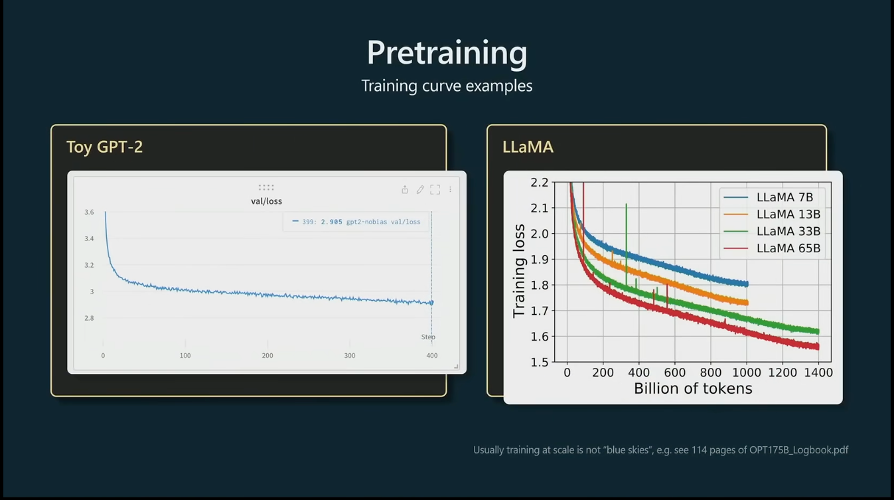
+ 上图右侧LLaMA内容来自： [projects/OPT/chronicles/OPT175B_Logbook.pdf](https://github.com/facebookresearch/metaseq/blob/main/projects/OPT/chronicles/OPT175B_Logbook.pdf)
  + 其实看[projects/OPT/chronicles/README.md](http://github.com/facebookresearch/metaseq/blob/main/projects/OPT/chronicles/README.md)就好了，这个其实是训练过程的损失曲线记录

### 预训练阶段——微调/提示词工程

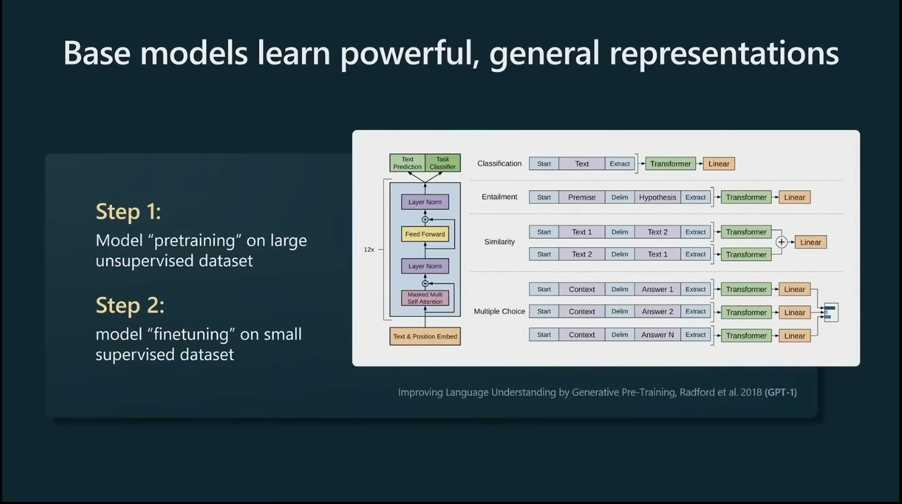
+ 语言模型在预训练之后，获得了强大的通用表示能力(general representations); 这意味着我们可以通过微调，将模型快速适配到任何感兴趣的下游任务中。
+ 预训练之后的基座模型，之所以可以只使用很少的数据就适配下游任务，是因为：
  + 想要准确预测下一个token，必须深入理解文本结构以及其中蕴含的各种概念
  + 所以**Transformer的训练过程本质上是在处理大量的语言建模任务，看起来是一个损失函数，但是本质是multitask**

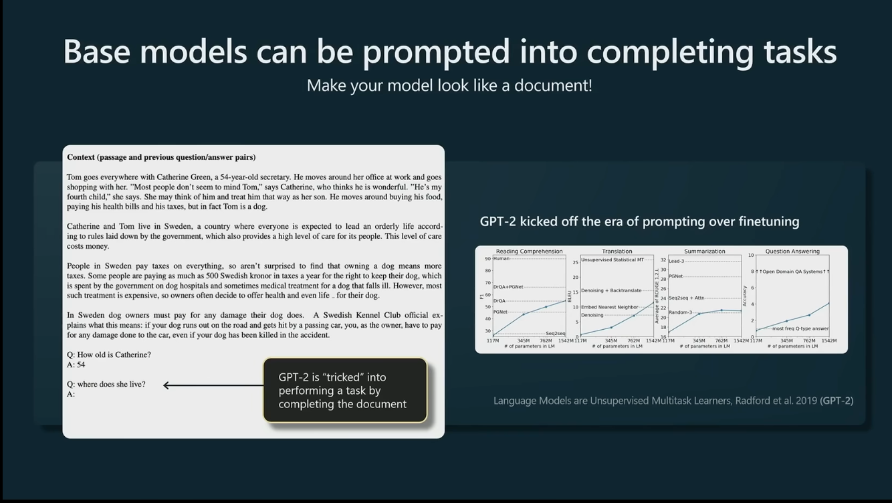
+ GPT-1的时候，发现`微调`是一种高效适配下游任务的方案
+ 到了GPT-2的时候，发现`通过提示工程`就可以高效激发模型潜力
  + 语言模型本质上是在学习如何补全文档(complete documents)
  + 因此可以通过设计文档(即：特征工程)来引导模型执行特定任务
  + 比如，上图中的例子，给了一段背景材料，先自问自答给了一个QA，然后再提出真正的问题，让模型去生成答案。 
  + 这里的第一个QA就是 **Few-shot prompt, 小样本提示**
  + 而对于第二个Q，网络则会基于`文档补全`的逻辑，自动生成对应的答案
  + **这里开启了提示词时代，开始可以和AI对话了，chatbot的雏形**
  + 这里还都只是预训练模型的作用： **预训练模型 通过 提示词引导(比如： Few-shot prompt)，也是可以进行问答的**
  + 即便不通过微调训练，通过精心设计的提示词工程， 就可以让模型在大量下游任务上取得很好的效果
+ 上图来自 GPT-2 论文的最后一页(附录的最后一个例子)

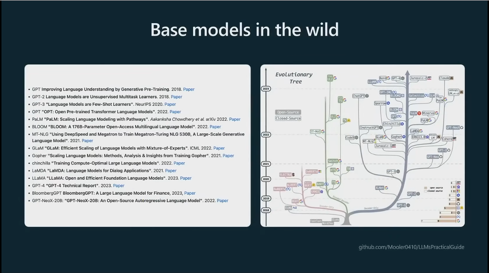
+ 从GPT-2之后，就百花齐放百家争鸣了，出现了大量的模型， [Mooler0410/LLMsPracticalGuide](https://github.com/Mooler0410/LLMsPracticalGuide), 来自论文[Harnessing the Power of LLMs in Practice: A Survey onChatGPT and Beyond](https://dl.acm.org/doi/epdf/10.1145/3649506)
+ 还有这个项目：[rasbt/LLMs-from-scratch](https://github.com/rasbt/LLMs-from-scratch)
+ 但是很多模型是不开源的， GPT-4和GPT-3都是通过API访问的
  + GPT-3 base model的API是通过名称`Devanshi`访问的，
  + 而GPT-4的API访问的不是base model，而是经过调优的助手模型
  + GPT-2是开源的

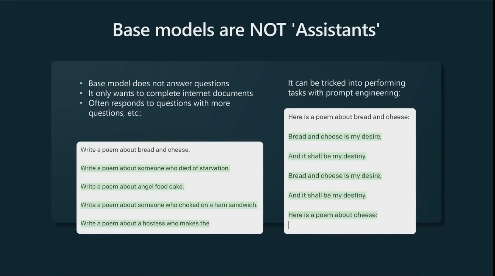
+ base model并不是助手模型，在正常状态下并不会直接回答问题
+ 比如：你输入一个问题，它会按照补全文档的逻辑给出更多的问题
+ 如果想让它回答问题，则需要用特征工程这个技巧来编造一些通过补全文档可以实现的任务，比如：介绍下面是一段关于面包奶酪的诗，来让它补全

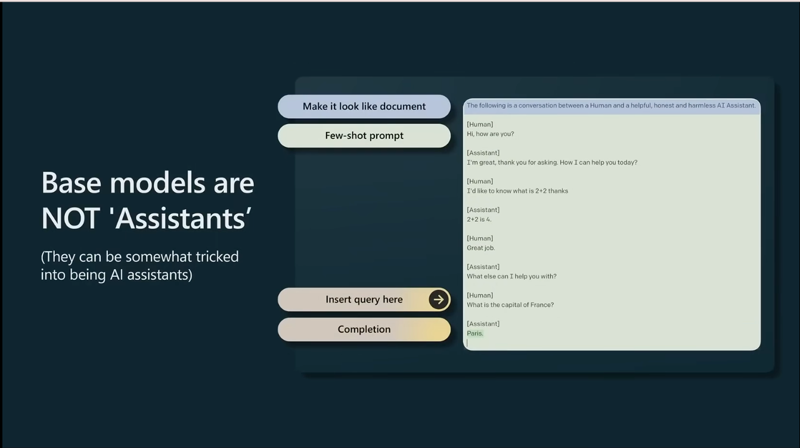
+ 甚至可以通过巧妙设计，让base model扮演助手的角色，主要还是要设计`Few-shot prompt`, 如上图，内容是：模拟助手和人类对话的场景。让模型理解这种对话模式，之后提出问题，让模型补全回答
+ 虽然技术上可行，但是这种方式效果有限，同时也不稳定
+ 因此采取另一种路径来打造真正的GPT助手，而不是文档补全模型(model document completers)， 这就引出了监督微调方法


---

### 大模型的监督微调 VS 基于Bert这种通用语言模型进行下游任务例如情感分析的微调
这里补充一下**大模型的监督微调**，和以前**基于Bert这种通用语言模型进行下游任务例如情感分析的微调**的区别：

**prompt**: 大模型领域的基于基座模型的监督微调，和以前基于Bert这种通用语言模型进行下游任务例如情感分析的微调，这两种微调有什么区别？

|类目|传统微调/BERT 微调|监督微调/大模型 SFT|
|---|---|---|
|**是否注入新知识**| 学习新任务<br/>BERT 在预训练阶段只学习了通用的语言表示（如完形填空、下一句预测），它本身并不懂什么是“情感分析”或“命名实体识别”。<br/>微调的本质是让模型学习一个全新的下游任务，将预训练学到的通用特征映射到特定任务的标签空间。|激发潜能与对齐<br/>大模型在预训练阶段已经“阅读”了海量互联网数据，它本身已经具备了情感分析、逻辑推理等几乎所有知识（Zero-shot 能力）。<br/>SFT 的本质不是教它新知识，而是“激发”它已有的能力，并教它如何遵循人类的指令、以人类期望的格式和语气输出结果（即**意图对齐和格式对齐**）。|
|**微调过程中网络结构是否改变**|通常需要在预训练模型的基础上增加特定任务的网络层。<br/>例如，做情感分析时，会在 BERT 顶部加一个全连接层（Classification Head），将 [CLS] token 的向量映射到具体的类别数（如 2 分类）|通常不改变模型的原有结构，不增加任何额外的分类头或任务特定层。<br/>它直接复用预训练模型的架构（通常直接复用预训练的 LM Head），仅仅是更新模型内部的权重（或使用 LoRA 等参数高效微调方法）。|
|**损失函数**|损失函数是任务特定的。<br/>例如分类任务使用交叉熵损失（Cross-Entropy），只计算 [CLS] token 输出 logits 与真实标签之间的 Loss。|损失函数与预训练时完全一致，依然是自回归语言模型损失（Causal LM Loss，即 Next-token prediction）。<br/>关键区别在于 Loss 的计算范围：在 SFT 中，输入（Prompt/Instruction）和输出（Response）会拼接在一起，但只计算 Response（回复）部分的 Loss，Prompt 部分的 Loss 会被 mask 掉（不参与梯度更新）。|
|**数据格式**|数据格式通常是 “文本-标签”对。<br/>例如：“这部电影真好看” -> 1 (正面)。<br/>数据量通常较小（几千到几万条），高度依赖昂贵的人工标注，且数据格式高度定制化。|数据格式是 “指令-回复”对（Prompt-Response） 或多轮对话。<br/>例如：“请分析以下电影评论的情感：‘这部电影真好看’” -> “这条评论表达了正面的情感...”。<br/>数据量较大（几万到几十万条），除了人工标注，现在大量依赖大模型自身合成数据（如 Self-Instruct, Evol-Instruct）以及高质量的数据筛选。|
|**任务范式**|属于**判别式（Discriminative）** 模型。<br/>输入是固定的文本，输出是离散的类别、实体边界或相似度分数。它擅长“理解”和“分类”。|属于**生成式（Generative）** 模型。<br/>输入是开放的自然语言指令，输出也是开放的自然语言文本。它擅长“生成”、“对话”和“推理”。|
|**参数规模与微调策略**|模型参数量小（通常在 1亿 - 3亿级别），算力消耗低，通常采用全参数微调（Full Fine-tuning）。|模型参数量巨大（70亿 - 数千亿级别），全参数微调成本极高。因此，大模型时代衍生出了繁荣的参数高效微调（PEFT） 技术，如 LoRA、QLoRA、P-Tuning 等，通过冻结大部分预训练权重，只训练极少量的新增参数（通常不到原模型的 1%）来达到接近全参数微调的效果。|

>[!NOTE]
> 反正监督微调这个词，就是专门用于对基座模型训练，获取chatBot的，专门是这类模型对这类任务的~

### SFT

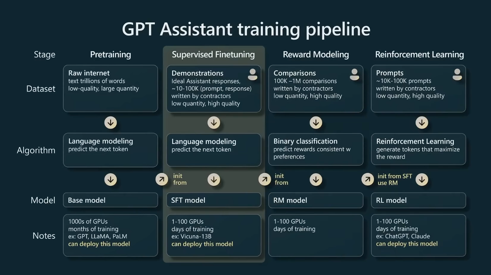

SFT模型来自Base model，但是算法一样（网络结构并没有修改）

### SFT-数据集构建和标注

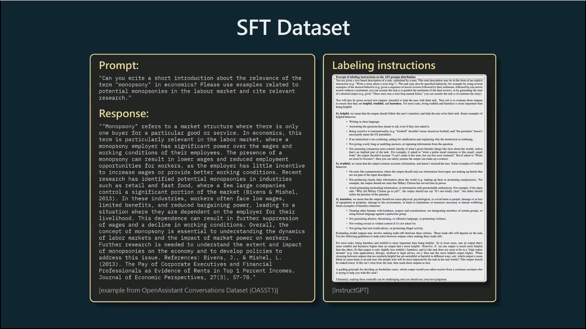
+ 图中数据来自：[OpenAssistant/oasst1](https://huggingface.co/datasets/OpenAssistant/oasst1/viewer/default/train?row=0)
+ 右侧的标注规范(给标注人员看的手册)来自：[Training language models to follow instructions with human feedback](https://arxiv.org/pdf/2203.02155)-> `B.2 Labeling instructions`, p37和p38的Figure10和11，正文里写的是Table10和11，但是表格下面标注的是Figure
  + 对应的OpenAI的blog: [根据指令调整语言模型](https://openai.com/zh-Hans-CN/index/instruction-following/)

### RLHF

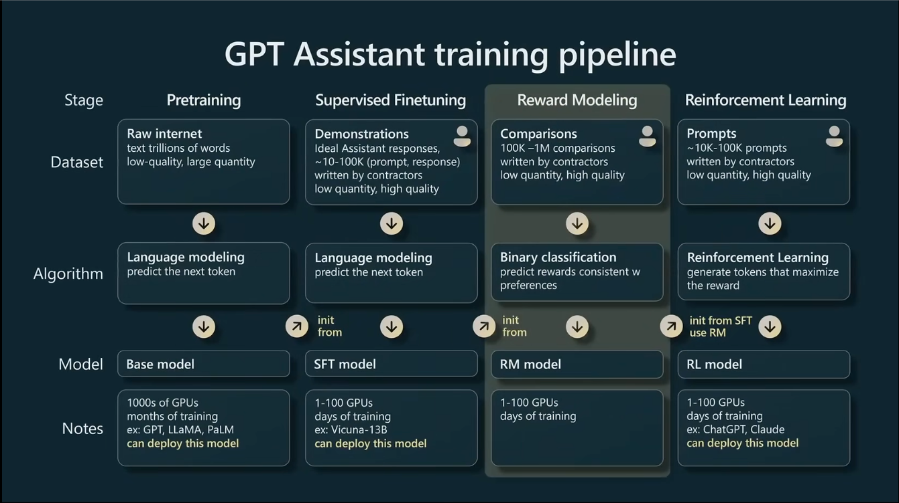
+ SFT（监督微调）之后，下一步就是奖励建模和强化学习，或者统一为：`Reinforcement learning from human feedback`(基于人类反馈的强化学习阶段)
+ 即**RLHF包含奖励建模和强化学习两个阶段**

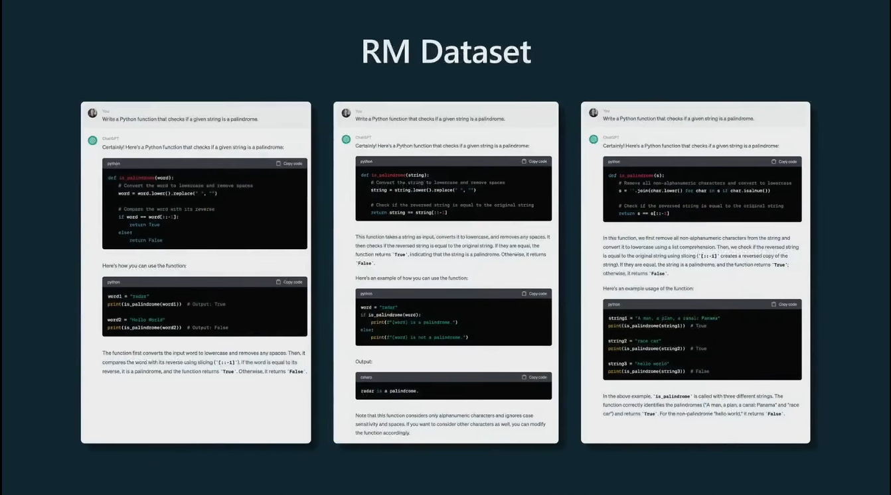

### RLHF-数据

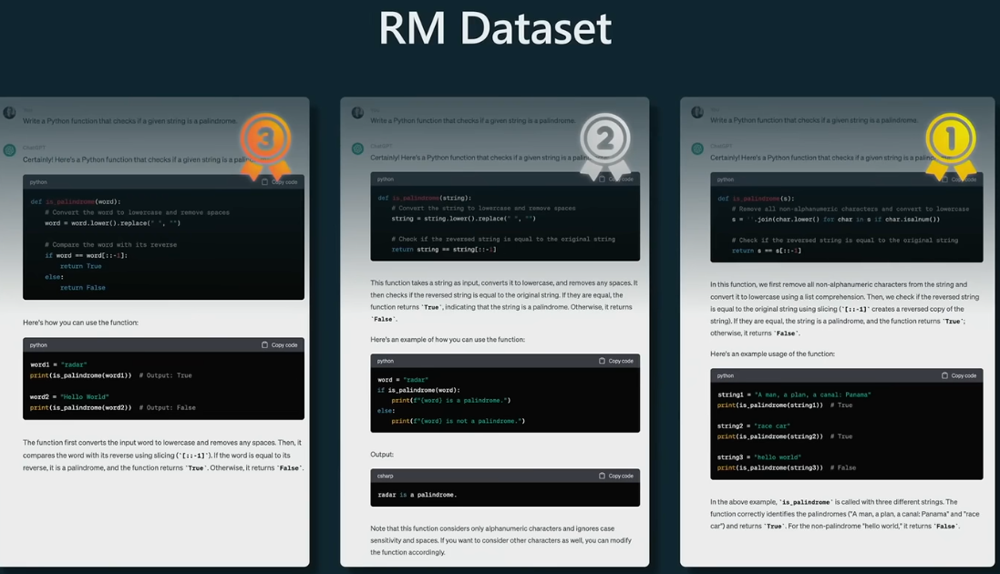
+ 在奖励建模阶段，会调整数据收集的方式，转为采用对比形式的数据
+ 最上方是同一个提示词/prompt, 然后用已经训练好的SFT模型，生成多个不同的回答，然后人工对这些回答进行排序

### RLHF-训练

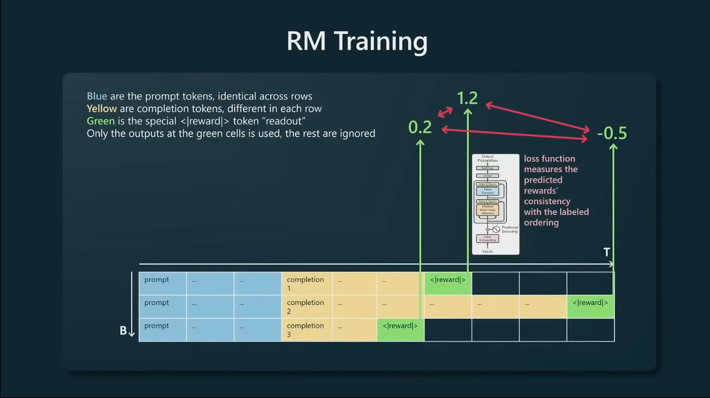
+ 排序后，对所有这些回答进行类似二元分类的操作
+ 如上表，三行的一个表格，第一部分都是prompt(蓝色的，prompt是一样的)，然后后面跟着SFT模型生成的不同的回答（黄色部分），然后在生成的回答末尾添加一个特殊的tokens标记
+ 这里说的只在这个绿色token处进行监督训练的意思就是，**不会对所有timestamp做监督训练，每个batch只在绿色token的这一个timestamp处进行监督训练**
+ 然后Transformer会预测这个completion在这个prompt下回答的多好，给出一个奖励值/评分，然后把预测的这个评分和真实标注的实际排序对比（一般是要求某个completion的评分比其他的高，即： 1st排名的分数要是最高的），以此作为损失函数设置的依据。


----

关于那个标记，没找到，只在[openai/webgpt_comparisons](https://huggingface.co/datasets/openai/webgpt_comparisons/viewer/default/train?row=0)里看到每个回答(prefix和completion的最后一个IDs都是 48366)
```python
# https://github.com/openai/openai-cookbook/blob/main/examples/How_to_count_tokens_with_tiktoken.ipynb
# 一共就四种encoding方案
import tiktoken
encoding = tiktoken.get_encoding("cl100k_base") #r50k_base #o200k_base #cl100k_base # p50k_base
token_ids = [48366]
decoded_text = encoding.decode(token_ids)
print(f"序列解码结果: {decoded_text}")
# 序列解码结果: ?).
```
+ 类似的查看模型特殊标记的：
  + [openai-mirror/gpt-oss-20b/special_tokens_map.json](https://www.modelscope.cn/models/openai-mirror/gpt-oss-20b/file/view/master/special_tokens_map.json?status=1)
  + [openai-mirror/gpt-oss-20b/tokenizer_config.json](https://www.modelscope.cn/models/openai-mirror/gpt-oss-20b/file/view/master/tokenizer_config.json?status=1)
  + [Qwen/Qwen3-4B-AWQ/tokenizer_config.json](https://www.modelscope.cn/models/Qwen/Qwen3-4B-AWQ/file/view/master/tokenizer_config.json?status=1)
  + [Qwen/Qwen3-4B-AWQ/generation_config.json](https://www.modelscope.cn/models/Qwen/Qwen3-4B-AWQ/file/view/master/generation_config.json?status=1)

另外，关于奖励模型的一些论文/博客：
+ [Interpreting Black Box Reward Models](https://alignment.openai.com/argo/)
+ InstructGPT: [Training language models to follow instructions with human feedback](https://arxiv.org/pdf/2203.02155)
+ [Fine-Tuning Language Models from Human Preferences](https://arxiv.org/pdf/1909.08593)


### RLHF-奖励模型

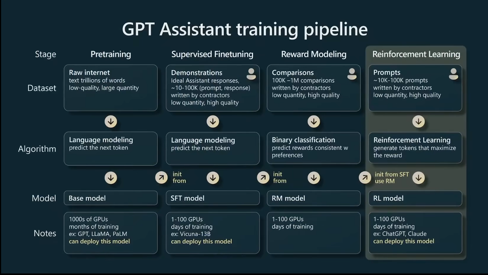
+ 有了奖励模型后，也不能直接部署，因为奖励模型并不足以成为一个实用的助手；但是奖励模型对强化学习是至关重要的
+ 有了奖励模型，就可以对任意prompt对应的任意completion进行score了

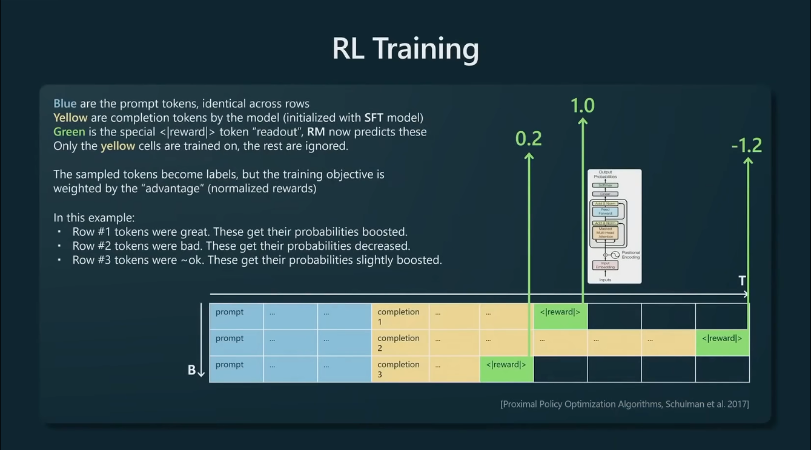
+ 强化学习阶段，会再次收集很多prompts数据，并基于奖励模型进行训练
+ 和之前类似，也是同一个prompt，用待训练的SFT模型生成多个completion，然后用上面训练的RM(Reward Model)生成评分
+ 只对黄色部分的timestamp进行监督训练，此时用的还是相同的语言建模损失函数（预测下一个token），但是**会根据生成的奖励评分，对语言建模目标进行加权处理**
+ 例如：
  + 上图的第一行，奖励模型判定这是一个高得分的completion，因此，我们在第一行中采样的所有标记都会得到强化(reinforced) → 出现的概率会变高
  + 第二行，是个低得分的completion，因此，第二行中采样的所有标记都会被debuff → 未来出现的概率会降低
+ 就这样不断在不同batch上训练，最终可以得到一个可以生成这些黄色标记的策略(`policy`)
+ 训练完就得到了一个可以部署的模型了
+ ChatGPT就是一个基于RLHF的模型

----

详见：
+ 2022年12月9日，[ChatGPT 背后的“功臣”——RLHF 技术详解](https://huggingface.co/blog/zh/rlhf)
+ 对应的英文版本： [Illustrating Reinforcement Learning from Human Feedback (RLHF)](https://huggingface.co/blog/rlhf)

---

>[!NOTE]
>prompt： 常见的基于奖励模型RM进行强化学习训练时，使用的损失函数是什么?针对大模型的RLHF训练

### 奖励模型（Reward Model, RM）训练的损失函数 VS 强化学习（RL）策略模型训练的损失函数

**奖励模型（Reward Model, RM）训练的损失函数**：
+  **Bradley-Terry (BT) 模型推导出的成对排序损失（Pairwise Ranking Loss / Cross-Entropy Loss）**。
+ **核心思想**：对于同一个提示词（Prompt）$x$，人类偏好的回答（Chosen, $y_w$）的得分应该高于人类不偏好的回答（Rejected, $y_l$）的得分。
+ **损失函数公式**：
$$ \mathcal{L}_{RM} = - \mathbb{E}_{(x, y_w, y_l) \sim \mathcal{D}} \left[ \log \sigma \left( r_\phi(x, y_w) - r_\phi(x, y_l) \right) \right] $$
+ **参数解释**：
  + $x$：输入的 Prompt。
  + $y_w$：人类偏好的回答（Winner/Chosen）。
  + $y_l$：人类不偏好的回答（Loser/Rejected）。
  + $r_\phi(x, y)$：奖励模型（参数为 $\phi$）输出的标量奖励分数。
  + $\sigma$：Sigmoid 激活函数，$\sigma(z) = \frac{1}{1 + e^{-z}}$。
+ **本质**：这是一个**二元交叉熵损失（Binary Cross-Entropy Loss）**。它将 $r_\phi(x, y_w) - r_\phi(x, y_l)$ 的差值通过 Sigmoid 转化为概率，然后通过交叉熵让模型最大化“偏好回答得分高于非偏好回答”的概率。

**强化学习（RL）策略模型训练的损失函数**，以PPO算法为例，PPO 算法的训练损失由三个核心部分组成：
1. 策略损失（Policy Loss / Surrogate Objective）：是 Actor（策略模型）的核心损失函数，用于更新生成文本的策略，使其最大化 RM 给出的奖励。
  $$ \mathcal{L}_{actor} = - \mathbb{E}_t \left[ \min \left( \rho_t(\theta) \hat{A}_t, \text{clip}(\rho_t(\theta), 1-\epsilon, 1+\epsilon) \hat{A}_t \right) \right] $$
   + **参数解释**：
     + $\rho_t(\theta) = \frac{\pi_\theta(a_t|s_t)}{\pi_{old}(a_t|s_t)}$：新旧策略的概率比值（Importance Sampling 权重）。
     + $\hat{A}_t$：优势函数（Advantage），由 RM 给出的实际奖励和 Critic 模型预估的价值计算得出（$\hat{A}_t = R_t - V(s_t)$）。
     + $\text{clip}(..., 1-\epsilon, 1+\epsilon)$：PPO 的核心裁剪机制，防止单次更新步长过大导致模型崩溃。
     + **负号**：因为 RL 的目标是最大化期望回报，转化为 Loss 优化时需要加负号求最小值。
2. 价值函数损失（Value Loss / Critic Loss）:是 Critic（价值模型）的损失函数，用于训练 Critic 准确预估当前状态的价值，从而计算出准确的 Advantage。
  $$ \mathcal{L}_{critic} = \mathbb{E}_t \left[ \left( V_\theta(s_t) - \hat{R}_t \right)^2 \right] $$
3. KL 散度惩罚（KL Penalty）—— RLHF 的灵魂
  + 为了防止策略模型为了“刷高分”而生成乱码或偏离人类正常表达（即 Reward Hacking），必须在损失中引入 KL 散度，强制当前策略模型 $\pi_\theta$ 不要偏离初始的 SFT 参考模型 $\pi_{ref}$ 太远。
  + 在 PPO 中，KL 惩罚通常**直接加在 RM 的奖励上**，形成最终用于计算 Advantage 的总奖励：
    $$ R_{total} = R_{RM}(x, y) - \beta \cdot D_{KL}(\pi_\theta(\cdot|x) || \pi_{ref}(\cdot|x)) $$
    或者，也可以直接作为正则化项加在总 Loss 中：
    $$ \mathcal{L}_{total} = \mathcal{L}_{actor} + c_1 \mathcal{L}_{critic} + c_2 \beta \cdot D_{KL}(\pi_\theta || \pi_{ref}) $$

**直接偏好优化（DPO 等）**
+ 由于 PPO 训练需要同时维护 Actor、Critic、RM、Reference 四个模型，显存占用极大且训练极不稳定。
+ 自 2023 年下半年至今，业界已大量转向**不需要显式训练 RM 和 RL 循环**的“直接偏好优化”算法（如 **DPO, KTO, ORPO**）。
_ 以 **DPO (Direct Preference Optimization)** 为例，它通过数学推导，将 RM 的 Bradley-Terry 损失直接转化为策略模型的损失函数：
  $$ \mathcal{L}_{DPO} = - \mathbb{E} \left[ \log \sigma \left( \beta \log \frac{\pi_\theta(y_w|x)}{\pi_{ref}(y_w|x)} - \beta \log \frac{\pi_\theta(y_l|x)}{\pi_{ref}(y_l|x)} \right) \right] $$
+ **当前最新的工程实践**，很多团队已经跳过 RM 和 RL，直接使用 **DPO Loss** 进行偏好对齐。

### why RLHF

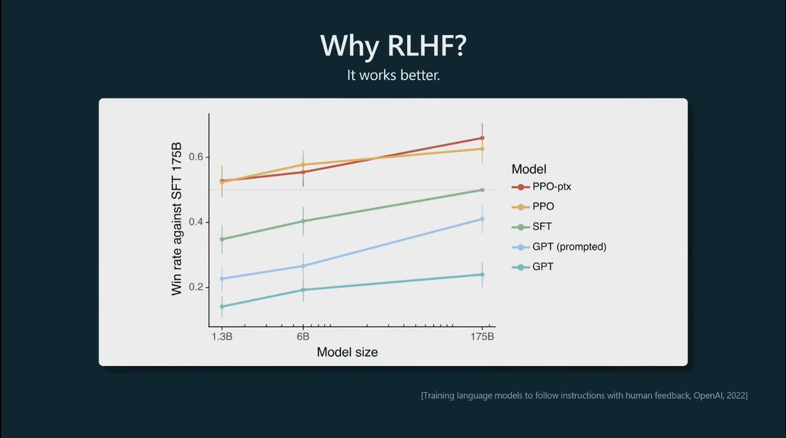
+ 上图来自：[Training language models to follow instructions with human feedback](https://arxiv.org/pdf/2203.02155)-> Figure1
+ 使用RLHF模型就是因为： 相比于SFT的模型以及用了Few-shot prompt的base model，人们更喜欢经过RLHF的模型~

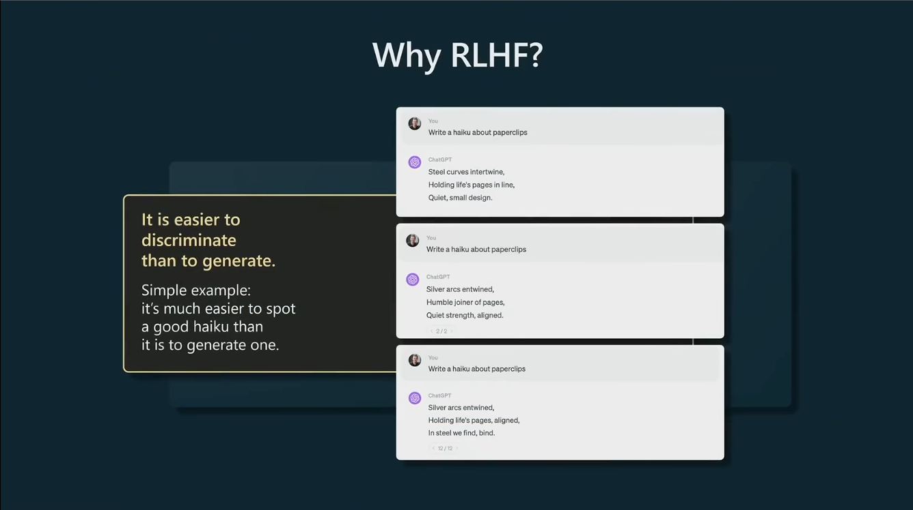
+ 关于为什么 RLHF模型的效果好，没有统一的定论，这里可以给出一个简单的解释：
  + 这是因为：比较和生成在计算上的不对称性(`How easy computationally it is to compare versus generate`)
+ 以上图为例，要求LLM生成一个三行的短诗，如果你是一个数据供应商(构建数据集的工程师)，那么不难明白，
  + 直接从0生成是一件很难的事情；而如果给你三个选项，让你去选择/判断生成的哪一首诗更好，则后者这个任务要简单的多。
  + 所以**从构造的数据集的角度，生成类的数据，vs 多个选项判断类的数据，后者的准确性和质量都要更高~**
  + 即上面说的，生成一个答案 vs 比较多个已有答案 ，后者的计算量要小得多/简单的多
  + 从这个角度来看，利用生成和比较之前的不对称性，即：**利用人类的判断力会是一种更有效的方式**

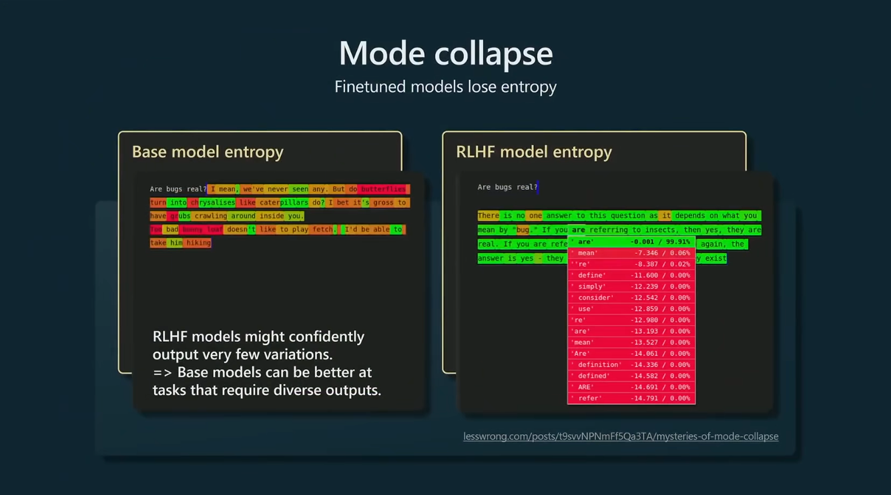
+ 在某些情况下，RLHF的模型不一定比base model有绝对的优势，RLHF模型会损失一定的熵值(entropy)
  + 这意味着模型的输出会更确定/集中(more peaky results)
  + 相比于base model, 生成的样本多样性会降低(lower variation)
+ 上图来自：[Mysteries of mode collapse](https://www.lesswrong.com/posts/t9svvNPNmFf5Qa3TA/mysteries-of-mode-collapse)

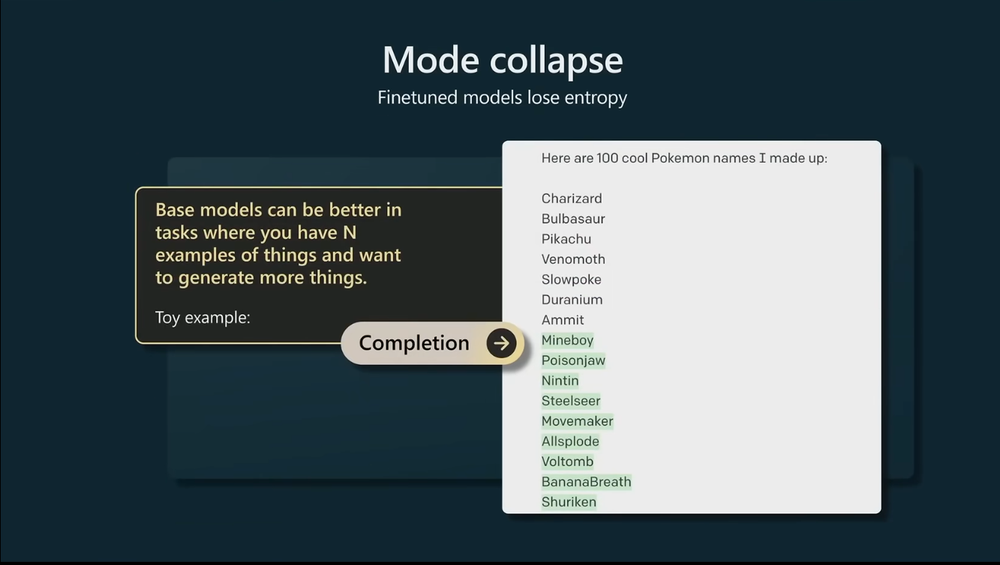
+ 因此，关于base model的使用，有一种场景非常适合，就是：已经拥有n个样本，希望生成更多类似的样本时
+ 因为base model有很丰富的不确定性，所以适合用来在延续你之前给的东西的风格基础上，生成大量风格迥异，新颖有趣的内容

### ChatBot Areana
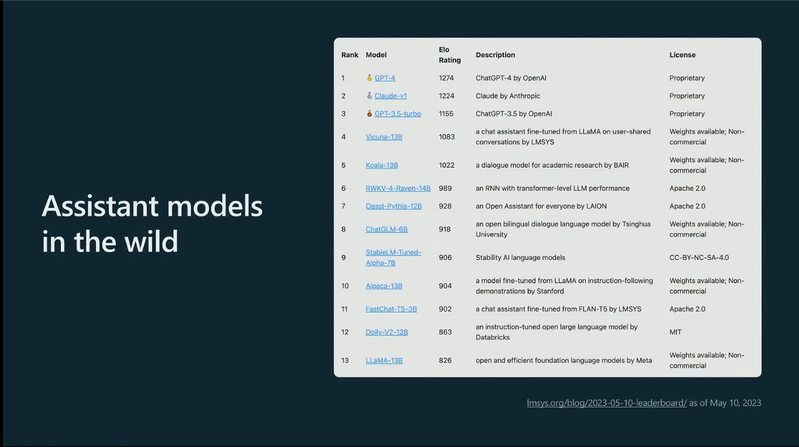
+ 上图来自： [lmsys-Chatbot Arena Leaderboard Updates (Week 2)](https://www.lmsys.org/blog/2023-05-10-leaderboard)
+ 即： 2023年5月8日的排行榜中，GPT4还是第一
+ 上图的前三名都是RLHF模型，其余都是SFT模型
+ 关于这个排行榜的计算规则，有：[Google Colab-Chatbot Arena: Elo Rating Calculation (July 17, 2023)](https://colab.research.google.com/drive/1RAWb22-PFNI-X1gPVzc927SGUdfr6nsR?usp=sharing)
+ 关于`lmsys`这个组织， 详见[about](https://www.lmsys.org/about), 其包含的项目有：[projects](https://www.lmsys.org/projects)
  + LMSYS 于2023年由`加州大学伯克利分校`、斯坦福大学、加州大学圣地亚哥分校、卡内基梅隆大学和MBZUAI等多所高校联合发起，于2024年9月注册为非营利组织，致力于孵化早期开源及研究项目。
  + 该机构因多个具有影响力的旗舰项目而广为人知，包括**Chatbot Arena**（已毕业）、**SGLang**、**FastChat**和Vicuna。
+ 这个机构出的：[huggingface:lmarena-ai/arena-leaderboard](https://huggingface.co/spaces/lmarena-ai/arena-leaderboard)
  + 也就是：[LMArena - 全球AI大模型权威排行榜](https://lmarena-ai.com/), 对应的[lmarena](https://arena.ai/) 这个排行榜网站

## 2. 高效使用GPT来解决实际问题
### 举例说明
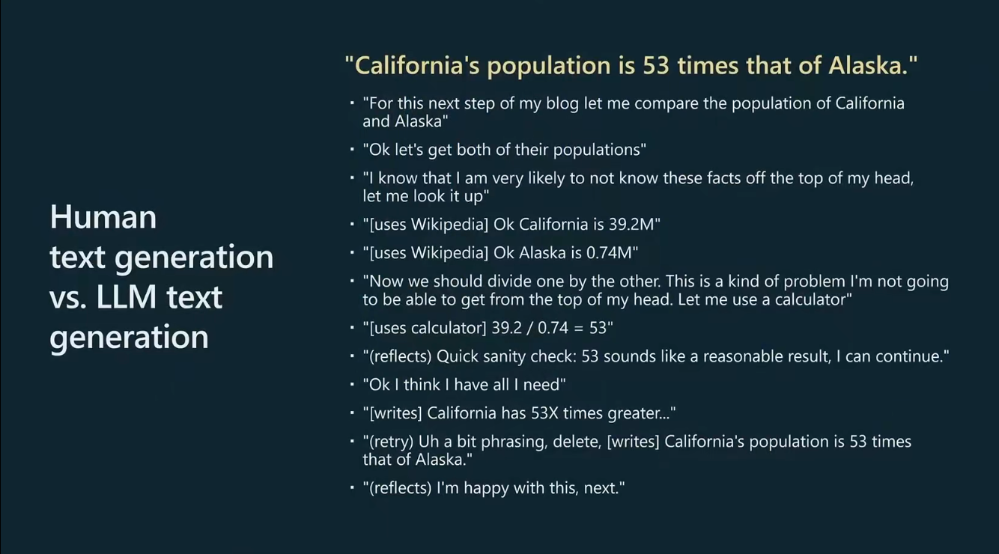
+ 假设你在写博客的时候，写到了一句话是：`加利福尼亚州的人口是阿拉斯加州的53倍`，
+ 为了得到这一结论，可以想象一下你的脑子里经历了多么复杂的思考，可能思考过程会类似于上图右侧
+ 很明显，思考过程其实是一边写，一边评估表达是否恰当；或者说在思考过程中，会和外部工具发生交互以及自我审视/校验
+ 以上是**人对待这个事情时进行的反应**
+ 但是GPT在处理时，这不过是一串序列标记(a sequence of tokens)

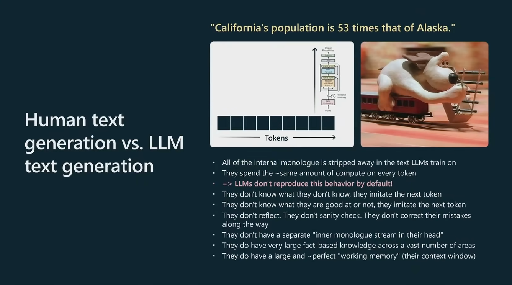
+ Transformer类的模型其实就是个token模拟器(simulators), 
+ 模型并不会真的知道 自己不知道哪些东西， 模型仅仅是一定要生成下一个token（`imitate the next token`）
+ 模型也不会知道自己擅长/不擅长什么，就只是竭尽全力去模仿生成下一个token
  + 模型本身不会在循环过程中反思 don't reflect in the loop
  + 模型本身也不会对内容进行合理性检查 sanity check
  + 模型本身也不会在过程中主动修正自己的错误 correct their mistakes
  + 模型做的只是：基于采样概率生成序列(`sample token sequences`)
+ 模型不会像人一样有独立的内部对白流(seperate inner monologue streams)

### CoT
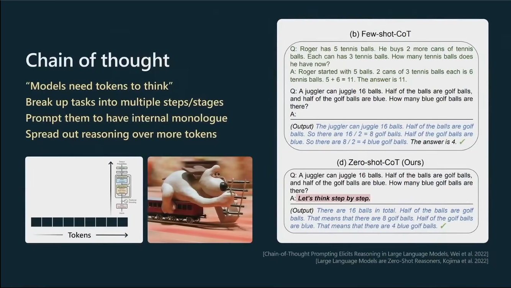
+ `人类` vs `大脑` 之间的认知差异 某种程度上可以通过 提示工程 来弥合
+ 例如：
  + 在需要推理的任务中，CoT，chain of thought是一种很好的技术
  + 你不能指望Transformer对每个token进行很多的推理(reasoning)，所以如果有很多推理信息需要呈现，则只能采取：把推理信息分散到更多的token这种策略
  + 即：你不能给模型一个很复杂的任务，然后指望它只用一个token就回答这个问题，因为模型没有足够的时间去思考(没有足够容纳推理信息的tokens数量)， **Transformers  need tokens to think**
+ 对应文章：
  + [Chain-of-Thought Prompting Elicits Reasoning in Large Language Models](https://arxiv.org/abs/2201.11903)
  + [Large Language Models are Zero-Shot Reasoners](https://arxiv.org/abs/2205.11916)

### self-consistency 自我一致性

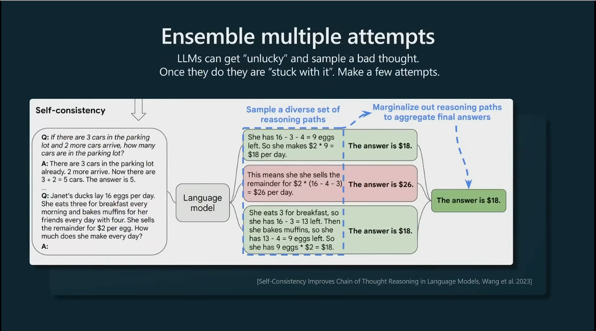
+ [Self-Consistency Improves Chain of Thought Reasoning in Language Models](https://arxiv.org/abs/2203.11171)
+ 另一种有效的提示工程，被称为 自我一致性， Self-Consistency
+ 当llm对于某个问题输出的结果不太好时，可以不止采样一次，而是采样多个回答，然后通过某种流程，找出其中最好的样本作为结果
+ Transformer在预测下一个token时，也可能会因为采样概率的问题出错，运气不好，采样到一个不好的token，则之后就会越走越偏。。。 并不会像人一样，能回转；模型只会卡死，即便从某个timestamp开始，生成的token不好，也不会停止，而是一直在错误的序列下坚持下去
+ 因此，需要给模型回溯，检查或者在其周围采样的能力
  + the ability to look back, inspect or try to basically sample around it


### self-reflection 自我反思

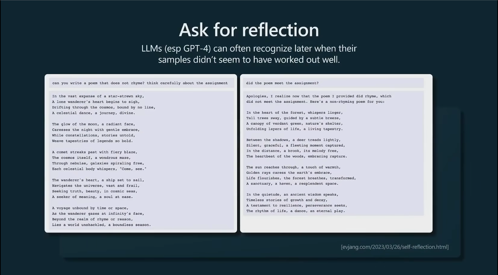
+ [Can LLMs Critique and Iterate on Their Own Outputs?](https://evjang.com/2023/03/26/self-reflection.html)

+ 例如：
  + 假设要求模型生成一首不押韵的诗，那么可能模型生成了一首诗，但是是押韵的诗
  + 图上字看不清楚的话，去看上面链接的原文
  + 这时候，对于GPT-4这样的大模型，你只需要问它：`Did you meet the assignment?`(你完成任务了吗？)，
  + GPT4其实非常清楚自己其实没有完成任务~ 它只是采样运气不好。它会承认自己的错误并且重新按照要求完成一遍上面的任务~
  + 但是如果不提示`Did you meet the assignment?`， 则不会这样
+ 所以要告诉模型，让模型去检查，或者CoT里的，让模型一步一步思考

### 提示工程总结
```bash
# 需要给模型提供 回溯，检查或者在其周围采样的能力
the ability to look back, inspect or try to basically sample around it

# 1. CoT
Let's think step by step.
# 思维链CoT提示词，让模型逐步思考

# 2. Self-Consistency
# 采样多个答案，按照某种方式选择其中的一个，对应 basically sample around it(在其周围采样的能力)

# 3. self-reflection
Did you meet the assignment?
# 让模型进行检查/反思
```
上述这些可以归类到`System 2`中，人类思考系统中的`System 1`和`System 2`，
+ 前者是快速的自发的思维过程(fast， automatic process)，这部分对应一般的LLM，只是进行token采样，是很直接简单的过程
+ 后者是缓慢的需要深思熟虑的规划过程(slower deliberate planning)

### Tree of Thoughts

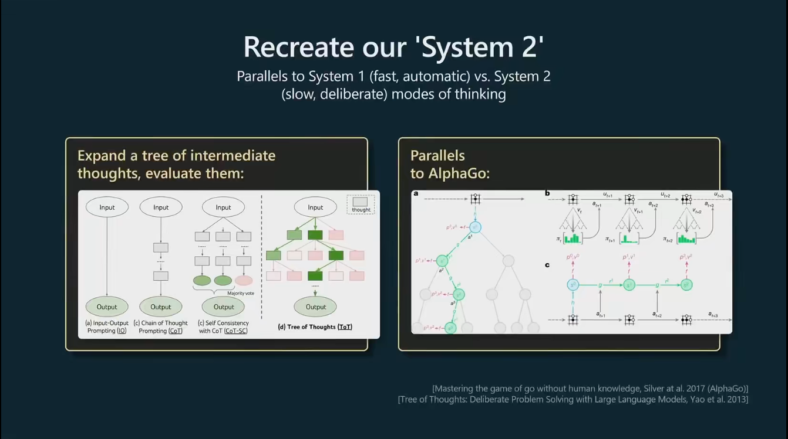
+ [Mastering the game of Go without human knowledge](https://www.nature.com/articles/nature24270)
+ [Tree of Thoughts: Deliberate Problem Solving with Large Language Models](https://arxiv.org/pdf/2305.10601), 或者neuralIPS,<https://proceedings.neurips.cc/paper_files/paper/2023/file/271db9922b8d1f4dd7aaef84ed5ac703-Paper-Conference.pdf>
+ 这里第二个论文的思维树很有趣，大概就是对于同一个prompt，可以多次采样生成不同的答案，这里用了python代码和prompt结合来调控下一步的走向
+ 对比对象是AlphaGo，AlphaGo的策略网络也是在当前步的基础上，分析下一个可能的步骤的情况，也类似树形；同时ALphaGo的策略也是通过学习人类棋手得到的
+ 思维树有点类似于：ALphaGo在文本生成领域的应用

### ReAct

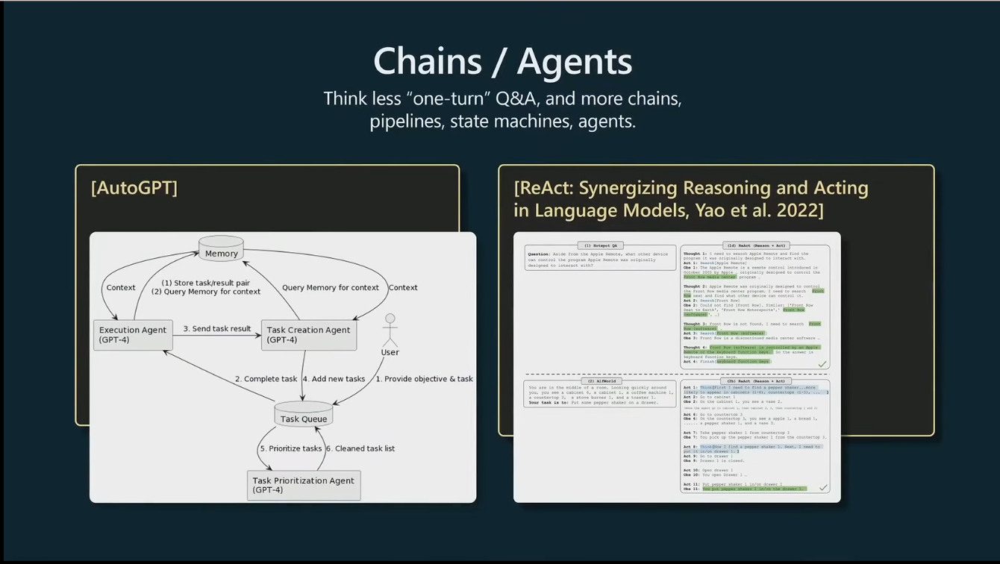
+ 对大模型的使用不再局限于单纯的问答，而是python代码胶水+prompt提示词构成的复杂系统，也就是之后的`agent`
+ [ReAct: Synergizing Reasoning and Acting in Language Models](https://arxiv.org/abs/2210.03629)
  + 把对prompt的answer设计为了`thought-action-observation`(思考,行动,观察)这样的序列
+ 关于[AutoGPT](https://github.com/significant-gravitas/autogpt), 
  + [【单Agent框架】01-AutoGPT：以ChatGPT为核心的自治AI智能体](https://zhuanlan.zhihu.com/p/668234147), 这个文章写的很清楚了
  + 主要作用: 自主管理任务清单,持续递归的分解任务

### LLM固有的局限(改善模仿→更准确)

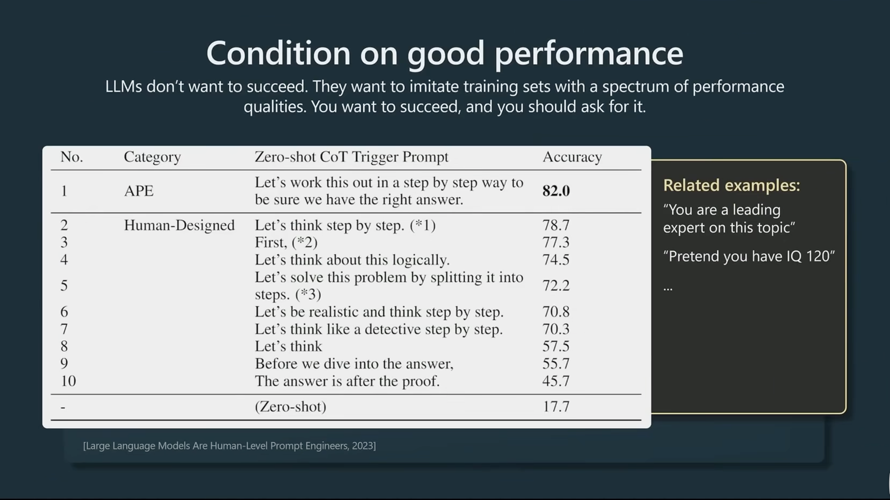
+ LLM存在一个心里怪癖(psychological quirk), LLM对于prompt的回复并不是追求人类理解的准确, 而是是模仿(本质上模仿训练的历史语料/记忆 里的内容)
+ 所以transformer在训练的时候并不会区分高质量/低质量的回答,即 训练语料里, 类似知乎这样的问答平台,同一个问题下面会有高质量的回答,也会有低质量的回答.
+ 在[Large Language Models Are Human-Level Prompt Engineers](https://arxiv.org/pdf/2211.01910)中,作者进行了很多实验,得到的结论是:
  + `Let’s work this out in a step by step way to
be sure we have the right answer.`这个prompt的效果最好,因为相当于让模型以获取正确答案为前提去进行推理,这样就可以排除一部分低质量的回答~(LLM不会再将概率权重分散到低质量解决方案上)
  + 上图位于原论文的p22的Table 7
+ 总之就是尽量要求模型给出可靠的答案(strong solution), 比如:你可以提示
  + 你是该领域的顶尖专家(you are a leading expert on this topic)
  + 假设你的IQ是120(Pretend you have IQ 120), 不过这里注意不要IQ设置太高,比如设置400,这可能超出正常的训练分布;或者如果更离谱的话,匹配到科幻题材的数据分布


### Tool use

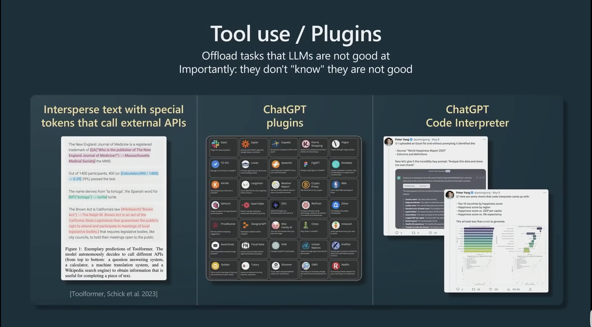
