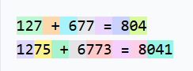
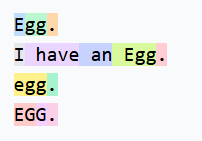
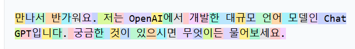
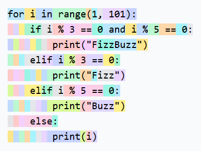
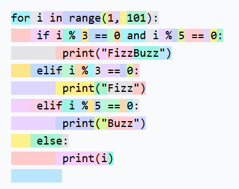

- [P9: 构建 GPT 分词器](#p9-构建-gpt-分词器)
  - [链接](#链接)
- [1. Tokenization](#1-tokenization)
  - [1.1 是很多奇怪现象的核心原因](#11-是很多奇怪现象的核心原因)
  - [1.2. tiktokenizer.vercel.app示例](#12-tiktokenizervercelapp示例)
- [2. unicode字符集， utf-8编码，utf-16编码以及utf-32编码](#2-unicode字符集-utf-8编码utf-16编码以及utf-32编码)
  - [2.1 unicode字符集 vs. utf-x编码](#21-unicode字符集-vs-utf-x编码)
  - [2.2 三种 UTF 编码的区别解析](#22-三种-utf-编码的区别解析)
  - [2.3. utf-8编码过程示例](#23-utf-8编码过程示例)
  - [2.4. UTF-8 的精妙之处](#24-utf-8-的精妙之处)
- [3. BPE](#3-bpe)
- [4. 其他分词算法](#4-其他分词算法)

# P9: 构建 GPT 分词器
## 链接
B站视频链接：
+ [Andrej Karpathy【中英⚡从零构建 GPT（重制版）|Neural Networks: Zero to Hero】](https://www.bilibili.com/video/BV1mqrTBvEaf/?p=3&spm_id_from=333.1007.top_right_bar_window_history.content.click&vd_source=1019ffdc843339404e9df6ae52ff9e77)

Github项目：
+ <https://github.com/karpathy/makemore>
+ [Github: karpathy/nn-zero-to-hero](https://github.com/karpathy/nn-zero-to-hero)

关键链接：
+ minBPE code: <https://github.com/karpathy/minbpe>
+ [Google Colab](https://colab.research.google.com/drive/1y0KnCFZvGVf_odSfcNAws6kcDD7HsI0L?usp=sharing)
+ <https://tiktokenizer.vercel.app/>


---

LLM中很多古怪的现象，往往都能追溯到分词(`Tokenizer`)这一步, 例如：
+ [为什么 MiniMax 大模型无法识别马嘉祺是谁？ - mm叶文洁的回答 - 知乎](https://www.zhihu.com/question/2017049686331127666/answer/2036149386116342692)
+ 这个其实就是因为`Tokenzier`这一步出了问题


# 1. Tokenization
## 1.1 是很多奇怪现象的核心原因

Tokenization is at the heart of much weirdness of LLMs. Do not brush it off.

- Why can't LLM spell words? **Tokenization**.
- Why can't LLM do super simple string processing tasks like reversing a string? **Tokenization**.
- Why is LLM worse at non-English languages (e.g. Japanese)? **Tokenization**.
- Why is LLM bad at simple arithmetic? **Tokenization**.
- Why did GPT-2 have more than necessary trouble coding in Python? **Tokenization**.
- Why did my LLM abruptly halt when it sees the string "<|endoftext|>"? **Tokenization**.
- What is this weird warning I get about a "trailing whitespace"? **Tokenization**.
- Why the LLM break if I ask it about "SolidGoldMagikarp"? **Tokenization**.
- Why should I prefer to use YAML over JSON with LLMs? **Tokenization**.
- Why is LLM not actually end-to-end language modeling? **Tokenization**.
- What is the real root of suffering? **Tokenization**.

分词是LLM诸多奇怪现象的核心原因，切勿忽视。
- 为什么LLM无法拼写单词？**分词**。
- 为什么LLM无法完成像字符串反转这样简单的字符串处理任务？**分词**。
- 为什么LLM在非英语语言（如日语）上表现更差？**分词**。
- 为什么LLM在简单的算术运算上表现不佳？**分词**。
- 为什么GPT-2在Python编程时遇到的困难比实际需要更多？**分词**。
- 为什么我的LLM看到“bit”这个字符串时突然停止？**分词**。
- 我收到的关于“尾随空格”的奇怪警告是什么意思？**分词**。
- 为什么当我问LLM“SolidGoldMagikarp”时它会出错？**分词**。
- 为什么我应该在使用LLM时更倾向于用YAML而不是JSON？**分词**。
- 为什么LLM实际上并不是端到端的语言建模？**分词**。
- 真正的痛苦根源是什么？**分词**。


## 1.2. tiktokenizer.vercel.app示例

Good tokenization web app: [https://tiktokenizer.vercel.app](https://tiktokenizer.vercel.app)
+ 注意，这个网页支持很多种分词工具，默认显示的是`OpenAI Models: gpt-4o`, 那些chat模型是有角色区分的，选择`OpenAI Encodings: gpt-2`,则就是单纯的编码，不区分角色，直接对所有文本进行编码
+ 复制下面这段文字进去，就可以看到编码结果了

Example string:

```
Tokenization is at the heart of much weirdness of LLMs. Do not brush it off.

127 + 677 = 804
1275 + 6773 = 8041

Egg.
I have an Egg.
egg.
EGG.

만나서 반가워요. 저는 OpenAI에서 개발한 대규모 언어 모델인 ChatGPT입니다. 궁금한 것이 있으시면 무엇이든 물어보세요.

for i in range(1, 101):
    if i % 3 == 0 and i % 5 == 0:
        print("FizzBuzz")
    elif i % 3 == 0:
        print("Fizz")
    elif i % 5 == 0:
        print("Buzz")
    else:
        print(i)
        
```

使用`OpenAI Encodings: gpt-2`分词时，上面这段文字刚好是`300个`token， 面的id和上面的单词是有对应关系的，自己滑动一下就看到了

|`OpenAI Encodings: gpt-2`现象|说明|
|---|---|
||**关于数字的token表示，是完全随机的**，`127`这个数字只用了一个token来表示，而`677`的`6`和`77`被拆开用两个token来表示，其余大部分数字也都是被拆成2~3个部分进行token表示的|
||同一个词语，出现在句首，句中，句末，表示也不同<br/>`Egg`出现在句首，会被拆成两个token表示；而出现在句末，则只会作为一个token表示；同时大小写也有所差异|
|<br/>|chatGPT在处理非英语的语言时效果要差一些<br/>这不仅是因为SFT/RLHF的语料中，非英语的内容要远远少于英语；同时也是因为预训练(tokenizer的语料里)非英语的内容也很少<br/>同时还有一个原因，就是对于日语，韩语，中文这些语言，其token的压缩率非常有限，即<br/>Hello, world! 你好,世界！ 안녕하세요, 세상！<br/>表达相同的内容，非英语的语言切割的chunk粒度更细，需要更多的token来表示(这里中文的叹号就用了三个token)<br/>对于Transformer固定的上下文窗口来说，表达相同的意思，非英语文本都被拉伸了。。可以理解为英语的tokens分布更均衡，而非英语的相当于在英语的分布上拉伸<br/>即英语的tokens分布一般都是很大的bins，而其他非英语的则会有很严重的长尾效应，即有很多小的边界tokens|
||代码里的每个空格都是一个单独的token，很明显，如果用这种`gpt-2`的分词方式，处理代码的方式就会很低效；<br/>所以`gpt-2`处理python代码效果很差，这与编程/语言模型本身无关，<br/>而是这些无意义的空格占据了大量的Transformer网络的上下文空间（序列长度不够用了），同时有效代码在整个序列中被分割的很零散|


----

如果把分词从`OpenAI Encodings: gpt-2`改为`cl100k_base`，则
+ 分词数量从300一下子降低到185，分词数量降低了非常多，
  + 根据[Language Models are Unsupervised Multitask Learners](https://cdn.openai.com/better-language-models/language_models_are_unsupervised_multitask_learners.pdf), The vocabulary is expanded to 50,257
  + gpt-2的词表大小为`50257`
  + 根据[Large Language Model Tokenizer Bias: A Case Study and Solution on GPT-4o](https://arxiv.org/html/2406.11214v2), For GPT-4, the vocabulary size includes 100,256 predefined common tokens, while this number increases to 199,997 in GPT-4o.
  + gpt-4的`cl100k_base`的词表大小为`100,256`
  + 由于**词表扩大了将近2倍，所以表示使用的token数量就降低了将近一半~**
+ [hello-gpt-4o-语言令牌化](https://openai.com/zh-Hans-CN/index/hello-gpt-4o/), 这里也着重列举了非英语语言在tokenizer过程中的token变化(`新令牌生成器压缩`)

词表扩大：
+ 当词表扩大为原来的2倍，则可以认为：Transformer可以看到的上下文窗口也是以前的两倍长(信息密度变高了)
+ 但是与之对应的是，嵌入表(`embedding`)的规模也会扩大,同时输出层的softmax计算量也会变大~

---


|`cl100k_base`对比|说明|
|---|---|
|| 当使用`cl100k_base`分词时，可以看到，代码的缩进空格部分有了明显的改善！<br/>所以`gpt2`到`gpt4`的代码能力的改进，不仅在于语言模型，架构设计和优化细节的改进，很大程度上还归功于tokenizer的设计|

Much glory awaits someone who can delete the need for tokenization. But meanwhile, let's learn about it.

从NLP任务中移除分词，会是个里程碑式的工作~


# 2. unicode字符集， utf-8编码，utf-16编码以及utf-32编码

## 2.1 unicode字符集 vs. utf-x编码
||Unicode|utf-x编码|
|---|---|---|
|基本概念|Unicode 是一本“字典”（字符集）|UTF-8/16/32 是这本字典的“三种不同打包运输方式”（编码实现）。|
|具体说明|Unicode（统一码/万国码）是一个**字符集（Character Set）**。它给世界上所有的文字、符号（包括汉字、英文、Emoji、甚至盲文）分配了一个**唯一的逻辑编号**，这个编号叫做**码点（Code Point）**。| UTF（Unicode Transformation Format）是具体的“编码方式”，是 Unicode 的**编码实现（Encoding）**。它规定了如何将 Unicode 的“码点”转换成计算机能存储和传输的“字节流（Bytes）”。|
|表达形式|通常以 `U+` 开头，加上十六进制数字表示。例如，汉字“中”的 Unicode 码点是 `U+4E2D`，Emoji“😀”的码点是 `U+1F600`。|
|局限|Unicode **只规定了编号，没规定怎么在计算机里存储**。计算机只认识 0 和 1（字节），如果你直接存 `4E2D`，计算机不知道这是一个 16 进制的数字，还是四个 ASCII 字符。因此，需要具体的**编码规则**来把码点转换成字节序列。<br/>本质上是因为Unicode的字符集有17w+,所以需要多个16进制数字来表示，|

---

## 2.2 三种 UTF 编码的区别解析

这三种编码方式的核心区别在于：**每个字符占用多少个字节（Byte），以及如何处理不同语言的字符。**
|——|utf-8|utf-16|utf-32|
|---|---|---|---|
|编码规则|**变长编码**，使用 **1 到 4 个字节**来表示一个 Unicode 码点。<br/>- 英文字母/数字（ASCII字符）：1 字节<br/>- 拉丁语系、希腊语等：2 字节<br/>- 汉字、日文、韩文等：3 字节<br/>- Emoji 或生僻字：4 字节|**变长编码**，使用 **2 或 4 个字节**表示一个码点。<br/>-  **BMP（基本多文种平面）字符**（包括绝大多数常用汉字、英文、日文等，码点在 `U+0000` 到 `U+FFFF`）：固定 **2 字节**。<br/>- **辅助平面字符**（如 Emoji、罕见汉字，码点在 `U+10000` 到 `U+10FFFF`）：使用 **4 字节**（通过“代理对 Surrogate Pair”机制，用两个 2 字节的特殊编码组合表示）。|**定长编码**，**任何字符都固定占用 4 个字节（32 bit）**。|
|最大特点|**完美向下兼容 ASCII**。纯英文文本用 UTF-8 编码和用传统的 ASCII 编码完全一样。它采用了“前缀码”设计（通过字节开头的 `0` 或 `1` 的个数来识别字节边界），即使数据截断也能快速恢复，不会乱码。|大小端问题（Endian）。因为 2 个字节有先后顺序，所以衍生出了 **UTF-16 LE**（小端序，Windows 常用）和 **UTF-16 BE**（大端序）。为了区分顺序，有时会在文件开头加一个 **BOM（Byte Order Mark，字节顺序标记）**。|直接把 Unicode 码点用 4 个字节存起来（例如 `U+4E2D` 直接存为 `00 00 4E 2D`）。|
|优点|空间利用率极高（英文不浪费空间）；容错率极高；网络传输最安全。|在处理绝大多数常用字符（2字节）时，处理速度比 UTF-8 快，因为大部分字符长度固定，方便内存中随机访问。|极其简单。因为每个字符都是 4 字节，所以可以像数组一样，通过 `索引 * 4` 瞬间找到第 N 个字符，**处理速度最快**。|
|缺点|因为变长，在内存中处理时，不能直接通过索引随机访问第 N 个字符，必须从头遍历计算长度。|对纯英文文本来说，比 UTF-8 浪费一倍空间；存在 BOM 和大小端的烦恼；遇到 4 字节的 Emoji 时，同样面临变长带来的索引计算问题。|**极其浪费空间**。哪怕存一个纯英文的 TXT 文件，体积也是 UTF-8 的 4 倍。|
|应用场景|互联网绝对的霸主（变长编码）<br/>**网页（HTML）、网络传输（HTTP/JSON）、Linux/Unix 文件系统、数据库存储**。目前 95% 以上的网页都使用 UTF-8。| UTF-16：Java/JS/Windows 的内部选择（变长编码）<br/>**Windows 操作系统内部 API、Java 语言内部字符串表示、JavaScript 语言内部、iOS/macOS 底层部分 API**。|简单粗暴的“空间换时间”（定长编码）<br/>极少用于存储和网络传输。主要用于**某些底层图形库、内部文本处理引擎**（在内存中临时展开处理，处理完再转回 UTF-8）。|


| 特性 | UTF-8 | UTF-16 | UTF-32 |
| :--- | :--- | :--- | :--- |
| **编码类型** | 变长（1-4 字节） | 变长（2 或 4 字节） | 定长（固定 4 字节） |
| **英文字符占用** | 1 字节 | 2 字节 | 4 字节 |
| **常用汉字占用** | 3 字节 | 2 字节 | 4 字节 |
| **Emoji/生僻字** | 4 字节 | 4 字节（代理对） | 4 字节 |
| **兼容 ASCII** | 完美兼容 | 不兼容 | 不兼容 |
| **空间效率** | 极高（最省空间） | 中等 | 极低（最浪费空间） |
| **处理/检索速度** | 较慢（需遍历计算长度）| 较快（大部分定长2字节）| 最快（直接按索引乘4） |
| **大小端/BOM问题**| 无（按字节流解析） | 有（LE/BE，可能有BOM）| 有（LE/BE，可能有BOM） |
| **主要应用场景** | **网络传输、文件存储、Web** | **Windows内部、Java/JS内存** | **内部文本处理引擎** |

## 2.3. utf-8编码过程示例

UTF-8 的核心编码规则表：UTF-8 是一种**变长编码**，它设计了 1 到 4 个字节的模板。规则如下：

| Unicode 码点范围 (十六进制) | 二进制位数 | UTF-8 编码模板 (字节) | 占用字节数 |
| :--- | :--- | :--- | :--- |
| `000000` - `00007F` | 7 ~ 1 位 | `0xxxxxxx` | 1 字节 |
| `000080` - `0007FF` | 11 ~ 8 位 | `110xxxxx 10xxxxxx` | 2 字节 |
| `000800` - `00FFFF` | 16 ~ 12 位 | `1110xxxx 10xxxxxx 10xxxxxx` | 3 字节 |
| `010000` - `10FFFF` | 21 ~ 17 位 | `11110xxx 10xxxxxx 10xxxxxx 10xxxxxx`| 4 字节 |

**规则解析（重点）：**
1. **模板中的 `x`**：是用来填写 Unicode 码点二进制位的地方。
2. **前缀标识**：
   * 单字节以 `0` 开头（完美兼容 ASCII）。
   * 多字节的首字节以连续的 `1` 开头，**`1` 的个数代表这个字符总共占用几个字节**（例如 `1110` 开头，说明是 3 字节）。
   * 多字节的后续字节，**一律以 `10` 开头**。
3. **填充顺序**：将 Unicode 的二进制位，**从左到右（从高位到低位）** 依次填入 `x` 的位置。如果 Unicode 的二进制位数不够 `x` 的总容量，高位补 `0`。

---

**具体转换过程演示（以汉字“中”为例）**
```python
char = "中"
# 1. 获取十进制的 Unicode 码点
decimal_code = ord(char)
print(f"十进制码点: {decimal_code}")  
# 输出: 十进制码点: 20013

# 2. 转换为十六进制 (Python 默认的 hex 格式)
hex_code = hex(decimal_code)
print(f"十六进制码点: {hex_code}")  
# 输出: 十六进制码点: 0x4e2d

# 对应的二进制为:
binary_code = bin(decimal_code)
print(f"二进制码点: {binary_code}")  # 返回的字符串会带有 0b 前缀（表示 binary

# 3. 格式化为标准的 Unicode 表示法 (U+XXXX)
# :04X 表示：至少4位，不足补0，字母大写 (X)
unicode_str = f"U+{ord(char):04X}"
print(f"标准 Unicode 值: {unicode_str}")  

# 输出：
十进制码点: 20013
十六进制码点: 0x4e2d
二进制码点: 0b100111000101101
标准 Unicode 值: U+4E2D
```

1. 获取 Unicode 码点并转为二进制
   * 汉字“中”的 Unicode 码点是 `U+4E2D`。
   * 将其转换为 16 位二进制（不足 16 位高位补 0），这里因为本身是15位，所以最靠近2字节，所以补足成2字节：
     `0100 1110 0010 1101`
2. 判断使用哪个模板
   * 查看码点 `4E2D`，它落在 `000800 - 00FFFF` 这个区间。
   * 因此，我们选择 **3 字节模板**：
     `1110xxxx 10xxxxxx 10xxxxxx`
3. 将二进制位填入 `x` 中
   * 3 字节模板总共有 `4 + 6 + 6 = 16` 个 `x`。
   * 我们的二进制刚好是 16 位，直接**从左到右**依次填入：

    ```text
    Unicode 二进制:  0100   111000   101101
                    ↓↓↓↓   ↓↓↓↓↓↓   ↓↓↓↓↓↓
    3字节模板:     1110xxxx 10xxxxxx 10xxxxxx
                    ↓↓↓↓   ↓↓↓↓↓↓   ↓↓↓↓↓↓
    填充得到三字节 11100100 10111000 10101101

    ```
4. 转换为十六进制（最终结果）:将上面得到的 3 个 8 位二进制数，分别转回十六进制：
  * `11100100` -> **`E4`**
  * `10111000` -> **`B8`**
  * `10101101` -> **`AD`**
  ```python
    > int("11100100", 2),int("10111000", 2), int("10101101", 2)  
    # 输出
    (228, 184, 173)
    
    > list(char.encode("utf-8"))
    # 输出
    [228, 184, 173]
  ```

>[!NOTE]
> + 汉字“中”在 UTF-8 编码下，最终在计算机里存储的字节流就是 **`E4 B8 AD`**。
> + 这也与 Python 中 ` '中'.encode('utf-8') ` 输出的 `b'\xe4\xb8\xad'` 完全吻合。

---

## 2.4. UTF-8 的精妙之处

1. **绝对兼容 ASCII**：
   英文字符的 Unicode 都在 `00-7F` 之间，用 UTF-8 编码时，直接走 1 字节模板 `0xxxxxxx`。这意味着，**纯英文的 UTF-8 文件和纯英文的 ASCII 文件在底层字节是完全一模一样的**。老系统不用改代码就能直接读 UTF-8 的英文。
2. **无字节序（Endian）问题**：
   UTF-16 和 UTF-32 需要区分大端序和小端序（先存高位还是低位），而 UTF-8 是按**字节流**逐个处理的，根本不存在字节序的烦恼。
3. **强大的自同步与容错能力**：
   因为多字节的首字节是 `110...`、`1110...`，后续字节是 `10...`。
   如果在网络传输中**丢失了第一个字节**，接收端看到后面的 `10...` 知道这是“残缺”的后续字节，会直接丢弃，直到遇到下一个 `0...` 或 `110...` 才会重新开始解析。**它绝不会把半个汉字错认成另一个字符**，极大地减少了乱码扩散。

**总结**：UTF-8 的转换过程，本质上就是**根据字符的大小，选择一个带“前缀标识”的固定模板，然后把 Unicode 二进制位像填空一样塞进去**的过程。


# 3. BPE
wiki上的解析其实就很清晰：[Byte-pair encoding](https://en.wikipedia.org/wiki/Byte-pair_encoding)

hugging-face上的教程也很清晰: [BPE tokenization 算法](https://huggingface.co/learn/llm-course/zh-CN/chapter6/5)


# 4. 其他分词算法

直接把字节序列输入到LLM中: [MEGABYTE: Predicting Million-byte Sequences with Multiscale Transformers](https://arxiv.org/abs/2305.07185)