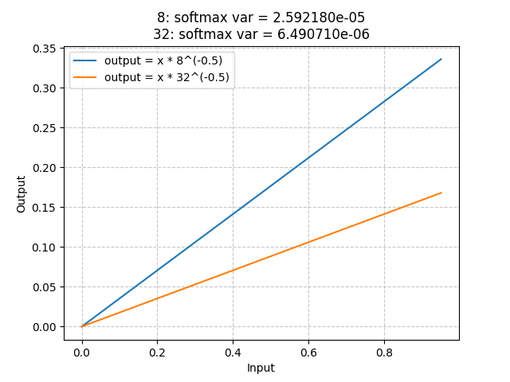

- [1. 张量的梯度理解(pytorch中每个张量单个元素的grad意味着为什么)](#1-张量的梯度理解pytorch中每个张量单个元素的grad意味着为什么)
  - [1.1 一维，二维，三维自变量的梯度含义(数形结合，笛卡尔坐标+向量)](#11-一维二维三维自变量的梯度含义数形结合笛卡尔坐标向量)
  - [1.2 优化器处理张量的视角](#12-优化器处理张量的视角)
  - [1.3  梯度更新-整个张量的所有分量梯度按学习率比例缩放](#13--梯度更新-整个张量的所有分量梯度按学习率比例缩放)
  - [1.4 示例总结](#14-示例总结)
  - [1.5 梯度下降的局限性（损失函数对每个参数分量的偏导减小的方向，不一定是全局减小的方向）](#15-梯度下降的局限性损失函数对每个参数分量的偏导减小的方向不一定是全局减小的方向)
- [2. register\_buffer() vs register\_parameter()](#2-register_buffer-vs-register_parameter)
- [3. 相同输出维度的单头和多头性能差异](#3-相同输出维度的单头和多头性能差异)
- [4. skip-connection的“零初始化” (Zero-Initialization)](#4-skip-connection的零初始化-zero-initialization)
- [5. transformer里的残差连接](#5-transformer里的残差连接)
- [X. transformer类网络和具体实现](#x-transformer类网络和具体实现)

# 1. 张量的梯度理解(pytorch中每个张量单个元素的grad意味着为什么)

参考：
+ <https://en.wikipedia.org/wiki/Gradient>
+ <https://www.khanacademy.org/math/multivariable-calculus/multivariable-derivatives/partial-derivative-and-gradient-articles/a/the-gradient>
+ <https://openstax.org/books/calculus-volume-3/pages/4-6-directional-derivatives-and-the-gradient>
+ <https://math.libretexts.org/Bookshelves/Calculus/Map%3A_Calculus__Early_Transcendentals_(Stewart)/14%3A_Partial_Derivatives/14.06%3A_Directional_Derivatives_and_the_Gradient_Vector>
+ <https://www.geogebra.org/m/sWsGNs86>

## 1.1 一维，二维，三维自变量的梯度含义(数形结合，笛卡尔坐标+向量)
y = x, dy/dx = 1, 绘图，单纯自变量轴，自+因的图

z = 2x + 3y, dz/dx = 2, dz/dy =3, 梯度就是(2,3),  单纯自变量轴，自+因的图； 

用学习率缩放 (1,1,5),大小变了，方向不变，绘图


## 1.2 优化器处理张量的视角

一个 `(3, 2)` 的张量看起来是一个矩阵（有行有列），怎么能像简单的二维向量 $(x, y)$ 那样去谈论“各个分量的比例”呢？

在深度学习框架（如 PyTorch）中，无论你的参数张量 shape 是 `(3, 2)`、`(256, 256, 3)` 还是更复杂的结构，**在计算梯度和更新参数时，优化器都会把它在逻辑上“展平（Flatten）”成一个一维的长向量。**

一个 shape 为 `(3, 2)` 的张量，包含 $3 \times 2 = 6$ 个元素。
在优化器的视角里，它根本不是什么 3行2列的矩阵，而是**一个长度为 6 的一维向量**：
$$ \mathbf{w} = [w_1, w_2, w_3, w_4, w_5, w_6]^T $$

在这里，“分量”指的不是矩阵的行或列，而是**张量里的每一个具体的数值（标量）**。这 6 个数值，就是 6 个分量。

张量被看作一个包含 $N$ 个数值的一维向量，我们就可以在 $N$ 维空间中讨论它的“方向”。

假设你的 `(3, 2)` 张量展平后的梯度是：
$$ \nabla L = [1, 2, 3, 4, 5, 6] $$

在 6 维空间中，这个向量的“方向”**是由这 6 个数值之间的“相对比例”决定的。**  即 $w_1 : w_2 : w_3 : w_4 : w_5 : w_6 = 1 : 2 : 3 : 4 : 5 : 6$。

1. **不存在“没有分量”的张量**：在优化器眼里，任何 shape 的张量都会被展平，张量里的**每一个具体数值**就是一个分量。
2. **方向由比例决定**：高维向量的方向，是由这些具体数值之间的**相对比例**决定的。
3. **学习率只缩放不偏转**：学习率是一个全局常数，它对所有分量乘以同一个数，**只改变绝对大小（步长），不改变相对比例（方向）**。因此，它永远是“真梯度”的体现。

## 1.3  梯度更新-整个张量的所有分量梯度按学习率比例缩放

```python
g = torch.Generator().manual_seed(2147483647) 
C  = torch.randn((vocab_size, n_embd), generator=g)
W1 = torch.randn((n_embd * block_size, n_hidden), generator=g) 
b1 = torch.randn(n_hidden, generator=g)
W2 = torch.randn((n_hidden, vocab_size), generator=g) 
b2 = torch.randn(vocab_size,  generator=g) 
parameters = [C, W1,b1, W2, b2]
print(sum(p.nelement() for p in parameters))
for p in parameters:
  p.requires_grad = True

for p in parameters:
    p.data += -lr * p.grad
# 这里在梯度更新的时候，是一整个张量的所有元素/分量，一起更新的，乘以学习率也是按比例全部分量一起缩放的
```

## 1.4 示例总结
```bash
a = torch.tensor(([[1,2,3], [4,5,6]]))
print(a.shape, a)
torch.Size([2, 3])
tensor([[1, 2, 3],
        [4, 5, 6]]

对于一个 (2,3)矩阵，拉平表示为[w1, w2, w3, w4, w5, w6], 则执行乘法运算(线性层)就等同于

z = a1w1 + a2w2 + a3w3 + a4w4 + a5w5 + a6w6
z = 3x + 4y
# 这里[a1, a2, ...,a6]其实就是每个分量的偏导， [w1,w2,..., w6]就相当于是在高维空间的6个轴上的投影值
# [a1, a2, ...,a6]合在一起的向量，就是梯度值
```


## 1.5 梯度下降的局限性（损失函数对每个参数分量的偏导减小的方向，不一定是全局减小的方向）
>[!NOTE]
>prompt: 假设有个参数，比如线性层的权重是(32,32), 那么其实就有1024个偏导数共同构成了这个权重的梯度，那么梯度更新的方向一定是保证是1024个偏导统一都向着损失减小的方向吗？

**在“局部一阶近似”和“学习率足够小”的理想前提下，是的； 但在实际的神经网络训练中，由于损失曲面的高度非凸性和参数间的强耦合，它只是一种“局部贪心”策略，并不保证是全局最优，也不绝对保证每一步整体损失都减小。**

---

1. 偏导数本身并不“统一”：**1024个偏导数本身的方向（正负号）是不统一的。**
   + 对于某个参数 $w_i$，如果它的偏导数 $\frac{\partial L}{\partial w_i} > 0$，意味着 $w_i$ 增加会导致损失**增加**。
   + 如果偏导数 $< 0$，意味着 $w_i$ 增加会导致损失**减小**。
   + 梯度下降的更新公式是 $w_i \leftarrow w_i - \eta \frac{\partial L}{\partial w_i}$。正是这个**减号（负号）**，把这1024个参数更新的方向，强行“统一”到了让损失减小的方向上。
2. 局部视角：每个参数都在做“局部最正确”的事
   + 对于第 $i$ 个参数，它的更新量是 $-\eta \frac{\partial L}{\partial w_i}$。
   + 根据一阶泰勒展开，如果**只改变这一个参数，保持其他1023个参数不动**，那么沿着负偏导方向更新，确实能让损失减小，且是**减小最快的方向**。
   + **从局部来看，这1024个参数中的每一个，都在根据自己的偏导数，做着“假设别人不动时，对自己最有利”的更新。**
3. 全局视角：为什么“各自为战”不一定等于“整体最优”？
   + 虽然每个参数在局部看来都在做正确的事，但当这1024个参数**同时更新**时，情况就变得复杂了。这就是**梯度下降的局限性**：
     + **参数之间的强耦合（非独立性）**：神经网络的损失函数不是简单的碗状（凸函数），而是极其复杂的“连绵山脉”（高度非凸）。参数 $w_1$ 和 $w_2$ 是相互影响的。**梯度下降在计算 $w_1$ 的更新方向时，假设了 $w_2$ 是不变的。但实际上 $w_2$ 也在同时更新。这种“各自为战”的贪心策略，组合起来的方向未必是整体下山的最优路径**。
     + **一阶近似的失效（学习率过大）**：梯度只看了“当前这一小步的坡度”（一阶导数），没有看“前方的地形弯曲程度”（二阶导数/曲率）。如果学习率 $\eta$ 设置得比较大，一阶泰勒展开的近似就不成立了。此时，虽然每个参数都在朝着“局部下坡”的方向走，但大家同时迈出的一大步，可能会直接跨过谷底，甚至走到对面更高的山坡上，导致**整体损失不降反升**（震荡或发散）。
4. 一个形象的比喻：1024个盲人下山。假设损失函数是一座地形极其复杂的山脉，1024个参数就是1024个绑在一起下山的盲人。
   + **梯度下降的做法**：每个盲人只能用脚探一探自己脚下这一小块地方的坡度（计算偏导数），然后朝着自己脚下**最陡的下坡方向**走一步。
   + **结果**：每个人都在努力往下走（局部损失减小），但因为地形复杂，有的人脚下是陡坡，有的人脚下是平地，有的人脚下其实是局部的小坑。这1024个人同时按各自的最陡方向走，整体队伍的行进路线可能非常曲折，甚至有时候会因为步子太大（学习率大）而集体摔进坑里（损失变大）。

---
总结
1. **数学上**：在当前位置的**局部切平面**上，梯度更新的方向确实是保证整体损失减小最快的方向，且每个分量的更新在局部也是使损失减小的。
2. **实际上**：由于神经网络是高度非凸的，梯度方向只是**当前点局部最优的贪心方向**。它没有考虑参数间的耦合和全局地形，因此不保证是全局最优方向。

这也是为什么在实际训练中，我们很少使用最原始的梯度下降（SGD），而是引入**动量（Momentum）** 来积累历史方向以抵抗局部噪声，或者使用 **Adam** 等自适应优化器，甚至研究**二阶优化算法（如K-FAC）**，目的都是为了**在复杂的参数耦合中，找到比“单纯看局部偏导”更好的“统一更新方向”**。


----

对于同样输出维度的单头和多头注意力机制
>[!NOTE]
>prompt: 在输出维度相同的情况下，例如： C=32, 直接用head_size=32的 scaled dot-product attention 单头注意力机制的结果，要比用head=4, head_size=8的multi_head Attention效果差，其实两种网络的参数大小和计算量一样，有梯度更新的原因吗？比如：单头的三个线性层是直接 32*32个元素一起更新，而多头则是4个 32*8元素分别更新，是否可以认为，参数的分量越少，这些分量之间的耦合或者对整体更新方向的影响越小，结果会越好？

`这不仅仅是“分量越少，耦合越小”这么简单`。

从**概率分布的方差**来看这个问题：
+ Softmax 在**低维空间**更容易形成尖锐的、稀疏的注意力峰值，梯度信号更清晰。
  + **尖锐、稀疏（大方差）**：意味着**概率高度集中在少数几个 Token 上**（比如某个位置权重是 0.8，其他都是 0.01）。这种分布的**方差很大，熵很小**。
+ 而在 32 维单头中，Softmax 的梯度往往更平滑，容易陷入“所有位置都关注一点”的平庸解。
  + **平滑（小方差）**：意味着概率均匀分散在所有位置上（比如 10 个位置每个都是 0.1）。这种分布**接近均匀分布，方差很小，熵很大**。
  +  Softmax 输出变成了一个方差极小的平滑分布，**模型退化成了一种简单的“全局平均池化”**。
+ 低维（8维）比高维（32维）更容易产生“大方差”

---

**总结**：
+ **平庸解（Meaningless Solution）**：如果只用一个 32 维的单头，模型容量太大，它倾向于用所有的维度去“平均”和“稀释”信息，导致注意力机制失去了“动态路由”和“稀疏选择”的核心优势，变成了毫无意义的加权平均。
+ **结构化分解与归纳偏置（Inductive Bias）**：MHA 将 32 维拆分成 4 个 8 维的头，这不仅仅是降维，更是引入了一种强烈的**归纳偏置（即先验假设）**。它强制假设：**“不同的特征子空间应该独立地去寻找最显著的、稀疏的注意力模式”**。
   + 通过降维（8维），限制了单个头的容量，**强迫**每个头只能去捕捉最尖锐、方差最大的特征。
   + 同时，多个头并行工作，使得模型能够在不同的子空间（如语法、语义、指代等）分别形成高方差的尖锐峰值，最后拼接起来，既保证了局部信号的清晰，又维持了全局表达的丰富性。
+ **MHA 通过降维（32->8），利用低维空间更容易放大特征差异的特性，迫使 Softmax 输出方差更大（更尖锐）的分布；这种大方差分布让梯度在反向传播时能够精准聚焦，从而避免了高维单头带来的梯度弥散和过度平滑（平庸解），使得模型的优化过程更加高效和友好。**

---

回到那个自注意力机制的公式： 

$$softmax(\frac{QK^T}{\sqrt{d_k}}V)$$

如下图，这里假设$QK^T$的结果就是下面的$x$， 是(0,1)之间的一个数字，

则上式其实就可以简化为： $y = a x$, 这里$a$就是斜率， 

对于不同的`head_size`, 这里的$a$分别为： $a = \frac{1}{\sqrt{8}}$和$a = \frac{1}{\sqrt{32}}$, 很明显，分母越大，整个分数越小，所以$\sqrt{32} >> \sqrt{8}$

所以 **`head_size`大的，对应的函数的斜率反而小，所以方差也小~**



从下面的实验中确实可以看出，缩放因子会影响softmax结果的梯度，缩放因子大的，softmax的方差反而小
```bash
# 缩放因子大小对点积结果的影响？
# 缩放因子本身就是为了把分布拉的和输入一样
import torch
# big = (torch.randn(32)*32**(-0.5)).sort()[0]
# small = (torch.randn(8)*8**(-0.5)).sort()[0]
test = torch.randn(10)
big = (test*32**(-0.5)).sort()[0]
small = (test*8**(-0.5)).sort()[0]
big_softmax = torch.nn.functional.softmax(big, dim = -1)
small_softmax = torch.nn.functional.softmax(small, dim = -1)
print(big)
print(small)
print(f"d_k = 32, big var = {big.var()}\nd_k = 8, var = {small.var()}")
print(f"d_k = 32, big_softmax.var = {big_softmax.var()}\nd_k = 8, small_softmax.var = {small_softmax.var()}")
# 统一用test作为输入，查看缩放因子对最终softmax的影响
# tensor([-0.3956, -0.2078, -0.1777, -0.1636, -0.1127, -0.0007,  0.0007,  0.1529,
#          0.1652,  0.4835])
# tensor([-0.7913, -0.4156, -0.3555, -0.3272, -0.2254, -0.0014,  0.0014,  0.3058,
#          0.3304,  0.9670])
# d_k = 32, big var = 0.06096453592181206
# d_k = 8, var = 0.24385814368724823
# d_k = 32, big_softmax.var = 0.0007161822286434472
# d_k = 8, small_softmax.var = 0.0033988922368735075
# ✅✅✅✅✅✅✅   低维（8维）比高维（32维）更容易产生“大方差”

# d_k越大，则对点积结果的缩放结果越大， 压缩的程度越高
In [12]: 1*32**(-0.5)
Out[12]: 0.1767766952966369

In [11]: 1*8**(-0.5)
Out[11]: 0.3535533905932738

In [9]: 0.8*32**(-0.5)
Out[9]: 0.14142135623730953

In [10]: 0.8*8**(-0.5)
Out[10]: 0.28284271247461906

In [5]: 0.5*32**(-0.5)
Out[5]: 0.08838834764831845

In [6]: 0.5*8**(-0.5)
Out[6]: 0.1767766952966369
```

# 2. register_buffer() vs register_parameter()

关于buffer， 根据
+ [Reference API -> torch.nn -> Buffer](https://docs.pytorch.org/docs/2.13/generated/torch.nn.parameter.Buffer.html)
+ [register_buffer](https://docs.pytorch.org/docs/2.13/generated/torch.nn.Module.html#torch.nn.Module.register_buffer)


其他参考：
+ https://discuss.pytorch.org/t/what-is-the-difference-between-register-buffer-and-register-parameter-of-nn-module/32723
+ https://stackoverflow.com/questions/57540745/what-is-the-difference-between-register-parameter-and-register-buffer-in-pytorch


# 3. 相同输出维度的单头和多头性能差异
>[!NOTE]
>**prompt**: 在输出维度相同的情况下，例如： C=32
为什么直接用head_size=32的 scaled dot-product attention 单头注意力机制的结果，要比用head=4, head_size=8的multi_head Attention效果差
其实两种网络的参数大小和计算量一样，这是为什么？  

在输出维度 $C=32$ 的情况下，**单头注意力（1个头，head_size=32）** 和 **多头注意力（4个头，head_size=8）** 的参数量和计算量是**完全相等**的。

“硬件成本”一样的情况下，多头的效果通常远好于单头的核心原因在于：**参数量决定了模型的“容量上限”，而多头机制决定了模型如何“高效且多样化地利用”这个容量。**

1. 表示子空间的多样性（Representation Subspace），这是多头注意力最核心的优势。
   + **单头注意力**：所有的特征都在同一个 32 维的空间中计算注意力。这意味着模型只能学习**一种全局的注意力模式**。所有的 Token 之间只能基于这单一的 32 维表示来计算相似度。
   + **多头注意力**：将 32 维空间划分成了 4 个 8 维的**独立子空间**。每个头在各自的子空间中独立计算。这允许模型在不同的子空间中捕捉**不同类型的特征交互**。例如，在 NLP 中，头 A 可能专门关注“语法关系”，头 B 关注“语义相似度”，头 C 关注“相邻位置关系”，头 D 关注“长距离依赖”。这种“分而治之”的策略极大地丰富了模型的表达能力。
2. 特征交互的解耦（Feature Disentanglement），从数学计算的角度来看，两者计算 Token 相似度的方式有本质区别：
   + **单头注意力**：两个 Token 的相似度是 32 个维度的**混合内积**（$q^T k = \sum_{i=1}^{32} q_i k_i$）。这强制模型在同一个空间里权衡所有 32 个维度的重要性，容易导致特征间的相互干扰。
   + **多头注意力**：相似度被分解为 4 个 8 维的**独立内积**。每个头只使用 8 个维度计算内积，这意味着每个头可以专注于这 8 个维度的特定组合，而**不受其他 24 个维度的干扰**。这种解耦使得特征提取更纯粹，模型能学到更结构化的表示。
3. 注意力模式的丰富度（Diversity of Attention Patterns），注意力机制的核心是 Softmax 产生的权重分布。
   + **单头注意力**：只能产生**一个** $N \times N$ 的注意力权重矩阵。它只能让模型去关注一种特定的上下文关系。
   + **多头注意力**：可以产生 **4 个不同**的 $N \times N$ 注意力权重矩阵。这使得模型能够**同时**关注序列中不同位置、不同方面的信息。即使最后拼接起来，它学到的注意力模式也是多视角、多模态的。
4. 优化过程与减少梯度冲突（Optimization & Gradient Conflict）， 在反向传播时，多头机制相当于在特征维度上引入了**隐式的集成（Ensemble）效果**。
   + **单头注意力**：所有的梯度都更新同一组 32 维的参数。如果任务需要同时关注两种冲突的特征（比如既要关注局部词法，又要关注全局语义），同一个 32 维权重矩阵的更新就会产生**梯度冲突**，导致优化困难。
   + **多头注意力**：每个头可以独立更新其对应的参数，梯度更新更加分散和稳定。不同的头可以各自朝着对自己负责的子任务优化，互不干涉，从而让整体模型更容易收敛到更优的解。

----
💡 一个通俗的类比

假设你要评估一份复杂的商业计划书（输入序列），你有 32 个评估维度（如财务、市场、技术、团队等）。

* **单头注意力（1个全科专家）**：你雇佣了 1 个极其聪明的全科专家，他同时用 32 个维度来评估这份计划书。但他只有一个大脑，在综合打分时，他必须自己权衡这 32 个维度的权重，很容易顾此失彼，或者被某些噪音维度带偏。
* **多头注意力（4个专科专家）**：你雇佣了 4 个专科专家（财务、市场、技术、团队），每人只负责 8 个维度。他们各自独立打分（4个不同的注意力矩阵），最后把 4 份报告拼在一起交给 CEO（线性投影层 $W_O$）做最终决策。显然，4 个专家各司其职，得出的评估结果会比 1 个全科专家全面、准确得多。


>[!NOTE]
> 在参数量和计算量相同的前提下，**多头注意力通过“空间划分”实现了特征解耦和表示多样性**。用同样的计算代价，换取了更丰富的特征交互视角和更稳定的优化过程


----

我个人从代码角度出发进行的解释：
```python
class Head(nn.Module):
     def __init__(self, head_size):
        super().__init__()
        self.head_size = head_size
        self.key = nn.Linear(n_embed, head_size, bias=False)
        self.query = nn.Linear(n_embed, head_size, bias=False)
        self.value = nn.Linear(n_embed, head_size, bias=False)
        self.register_buffer('tril', torch.tril(torch.ones(block_size, block_size)))
      
      def forward(self, x):
        B, T, C = x.shape
        k = self.key(x)        # k(B,T,head_size)
        q = self.query(x)      # q(B,T,head_size)
        v = self.value(x)      
        weight = (q@k.transpose(-2,-1))*self.head_size**(-0.5)   
        weight = weight.masked_fill(self.tril[:T,:T]==0, float('-inf'))
        weight = F.softmax(weight, dim = -1)
        out = weight@v        # (B,T,T)@(B,T,head_size) → (B,T,head_size)
        return out


class MultiHeadAttention(nn.Module):
    def __init__(self, num_heads, head_size):
        super().__init__()
        self.heads = nn.ModuleList([Head(head_size) for _ in range(num_heads)])
    def forward(self, x):
        return torch.cat([h(x) for h in self.heads], dim = -1)

# 常见的梯度更新代码
for p in parameters:
  p.data += -lr * p.grad
```

从上面代码可以知道，假设最后无论单头或者多头返回的最终结果都是 `(B,T,32)` , 则
|项目|单头|多头|
|---|---|---|
|K,Q,V线性层维度(W.shape)|$W^K=(32,32)$,<br/>$W^Q=(32,32)$,<br/>$W^V=(32,32)$|$W^{K_1}=(32,8), W^{K_2}=(32,8), W^{K_3}=(32,8), W^{K_4}=(32,8)$,<br/>$W^{Q_1}=(32,8), W^{Q_2}=(32,8), W^{Q_3}=(32,8), W^{Q_4}=(32,8)$,<br/>$W^{V_1}=(32,8), W^{V_2}=(32,8), W^{V_3}=(32,8), W^{V_4}=(32,8)$
|scaled尺寸| $softmax(\frac{QK^T}{\sqrt{32}})V$<br/> 单头的缩放因子很小，会导致点积结果的方差较大，输入到 Softmax 后，极易进入饱和区（即某个位置的概率接近1，其他接近0）。在饱和区，Softmax 的梯度会趋近于0，导致梯度消失。|$(softmax(\frac{Q_1K_1^T}{\sqrt{8}})V_1, softmax(\frac{Q_2K_2^T}{\sqrt{8}})V_2, softmax(\frac{Q_3K_3^T}{\sqrt{8}})V_3, softmax(\frac{Q_4K_4^T}{\sqrt{8}})V_4$<br/>多头由于缩放因子更大，使得 Softmax 前的 logits 分布更平滑，不容易饱和，从而保证了更健康的梯度流|
|softmax计算差异|单头的softmax归一化的时候需要处理32个数字，是`32个数字来瓜分1`，<br/>最极端的情况，**如果这32维是个one-hot向量，则单头只吸收了一个token的信息**<br/>32维度统一算softmax，肯定会导致次大的，或者次次大的，不会分配那么多注意力，<br/>而如果放在多头里，次大则会变成多头里单个head的最大，就会获得充分的注意力|多头的softmax归一化的时候只需要处理8个数字，是`8个数字瓜分1`<br/>最极端的情况，**如果这8维是个one-hot向量, 多头其实还是吸收了4个token的信息**|
|初始化差异|虽然`nn.Linear`都是 均匀分布，但是总归会有那么一些些差异，可以引入一些随机性，**单头的随机性肯定要小于多头**|
|梯度更新差异|只有3个可更新的参数，W里的所有32*32个元素是一起更新的，根据[## 1.5 梯度下降的局限性（损失函数对每个参数分量的偏导减小的方向，不一定是全局减小的方向）](#15-梯度下降的局限性损失函数对每个参数分量的偏导减小的方向不一定是全局减小的方向), 一起更新的参数越多，参数之间耦合的情况越大|


# 4. skip-connection的“零初始化” (Zero-Initialization)
关键参考：
+ skip connection, 2016年 [Identity Mappings in Deep Residual Networks](https://arxiv.org/pdf/1603.05027)
+ Resnet, 2015年 [Deep Residual Learning for Image Recognition](https://arxiv.org/pdf/1512.03385)
+ [torchvision/models/resnet.py # zero_init_residual](https://github.com/pytorch/vision/blob/main/torchvision/models/resnet.py#L218)
  + [Accurate, Large Minibatch SGD:Training ImageNet in 1 Hour](https://arxiv.org/pdf/1706.02677)

```python
# https://github.com/pytorch/vision/blob/main/torchvision/models/resnet.py#L218  
# 关键代码

if zero_init_residual:
   for m in self.modules():
         if isinstance(m, Bottleneck) and m.bn3.weight is not None:
            nn.init.constant_(m.bn3.weight, 0)  # type: ignore[arg-type]
         elif isinstance(m, BasicBlock) and m.bn2.weight is not None:
            nn.init.constant_(m.bn2.weight, 0)  # type: ignore[arg-type]

```

# 5. transformer里的残差连接
`transformer`里的`skip-connection`, 详见：
+ [torch/nn/modules/transformer.py # TransformerDecoderLayer](https://github.com/pytorch/pytorch/blob/main/torch/nn/modules/transformer.py#L985)
+ [On Layer Normalization in the Transformer Architecture](https://arxiv.org/pdf/2002.04745v1)
+ 原始的transformer论文里给的实现链接，是tensorflow写的，实现有点复杂
  + [tensor2tensor/models/transformer.py](https://github.com/tensorflow/tensor2tensor/blob/master/tensor2tensor/models/transformer.py#L186)
  + [tensor2tensor/layers/transformer_layers.py](https://github.com/tensorflow/tensor2tensor/blob/master/tensor2tensor/layers/transformer_layers.py#L138)
  + [tensor2tensor/layers/transformer_memory.py](https://github.com/tensorflow/tensor2tensor/blob/master/tensor2tensor/layers/transformer_memory.py)


# X. transformer类网络和具体实现
+ 老师的实现其实是位于： <https://github.com/karpathy/ng-video-lecture/blob/master/gpt.py>
+ 原始的transformer网络结构可以参考：<https://github.com/pytorch/pytorch/blob/main/torch/nn/modules/transformer.py>
  + 进一步，在`from .activation import MultiheadAttention`: [torch/nn/modules/activation.py#MultiheadAttention](https://github.com/pytorch/pytorch/blob/main/torch/nn/modules/activation.py#L1469)
  + 进一步，在[torch/nn/modules/activation.py # F.multi_head_attention_forward](https://github.com/pytorch/pytorch/blob/main/torch/nn/modules/activation.py#L1469)， 或者[torch/nn/modules/activation.py# torch._native_multi_head_attention](https://github.com/pytorch/pytorch/blob/main/torch/nn/modules/activation.py#L1434)
  + 进一步： [torch/nn/functional.py # multi_head_attention_forward](https://github.com/pytorch/pytorch/blob/v1.9.0/torch/nn/functional.py#L4836)
+ 上面最新的`transformer.py`实现太复杂了，加了很多冗余的功能，
  + 翻历史，找到最初版本的transformer实现，原始，捡漏，主线明确：
  + [756a20de9 分支 torch/nn/modules/transformer.py](https://github.com/pytorch/pytorch/blob/756a20de932f5ee99b66df862fe452d31af02e76/torch/nn/modules/transformer.py)
  + [756a20de9 分支 torch/nn/modules/activation.py](https://github.com/pytorch/pytorch/blob/756a20de932f5ee99b66df862fe452d31af02e76/torch/nn/modules/activation.py#L775)
  + [756a20de9 分支 torch/nn/functional.py](https://github.com/pytorch/pytorch/blob/756a20de932f5ee99b66df862fe452d31af02e76/torch/nn/functional.py#L3094)
+ 如果想在transformers库里看其他网络的相关实现：
   + Encoder最经典的实现是 BERT (BertSelfAttention): 
     + https://github.com/huggingface/transformers/blob/main/src/transformers/models/bert/modeling_bert.py#L139
   + 带 Mask 的 Decoder最经典的实现是 GPT-2 (GPT2Attention): 
     + https://github.com/huggingface/transformers/blob/main/src/transformers/models/gpt2/modeling_gpt2.py#L75
   + 同时包含 Encoder 和 Decoder，并且两者通过 Cross-Attention 交互的完整原始架构，最贴近的参考是 BART 或 T5
      + https://github.com/huggingface/transformers/blob/main/src/transformers/models/bart/modeling_bart.py#L143
      + https://github.com/huggingface/transformers/blob/main/src/transformers/models/t5/modeling_t5.py#L176